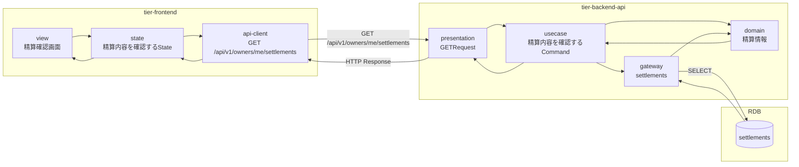
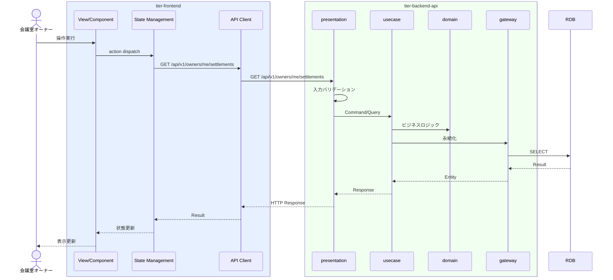

# 精算内容を確認する

## 概要

オーナーが精算額（月次精算金額、支払状態）を確認する。

## データフロー



| レイヤー | データモデル | 変換内容 |
|---------|------------|---------|
| FE View | 精算確認画面の表示/入力 | ユーザー操作 → state 更新 |
| BE presentation | Request | バリデーション + Command変換 |
| BE gateway | SELECT settlements | レコード操作 |
| Response | SettlementListResponse | 表示用データ |

## 処理フロー



## バリエーション一覧

該当なし

## 分岐条件一覧

該当なし

## 計算ルール一覧

該当なし


## 状態遷移一覧

該当なし

## 関連 RDRA モデル

| モデル種別 | 要素名 | 関連 |
|-----------|--------|------|
| 業務 | 精算業務 | このUCが属する業務 |
| BUC | オーナー精算フロー | このUCを含むBUC |
| アクター | 会議室オーナー | 操作するアクター |
| 情報 | 精算情報 | 参照・更新する情報 |


## E2E 完了条件（BDD）

### 正常系

```gherkin
Feature: 精算内容を確認する

  Scenario: オーナーが精算内容を確認する
    Given 会議室オーナー「田中太郎」が精算確認画面を表示している
    When ページが読み込まれる
    Then 月次精算一覧が表示され2026年3月分の精算金額「202,500円」、支払状態「支払済」が確認できる
```

### 異常系

```gherkin
  Scenario: 精算情報がない場合
    Given 新規登録直後の会議室オーナーが精算確認画面を表示している
    When ページが読み込まれる
    Then 「まだ精算情報はありません」の空状態メッセージが表示される
```

## ティア別仕様

- [フロントエンド](tier-frontend.md)
- [バックエンドAPI](tier-backend-api.md)

### 統合 API Spec

- [OpenAPI Spec](../../../_cross-cutting/api/openapi.yaml)
