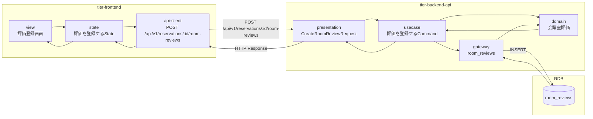
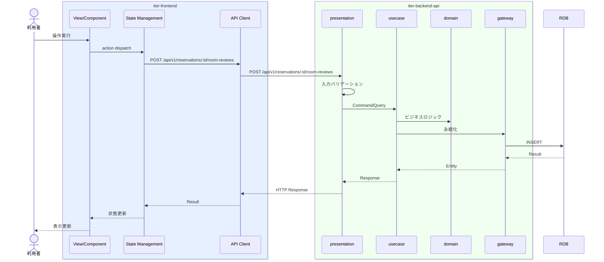

# 評価を登録する

## 概要

利用者が利用した会議室とホストの評価（会議室評価点、ホスト評価点、コメント）を登録する。

## データフロー



| レイヤー | データモデル | 変換内容 |
|---------|------------|---------|
| FE View | 評価登録画面の表示/入力 | ユーザー操作 → state 更新 |
| BE presentation | CreateRoomReviewRequest | バリデーション + Command変換 |
| BE gateway | INSERT room_reviews | レコード操作 |
| Response | RoomReviewResponse | 表示用データ |

## 処理フロー



## バリエーション一覧

| バリエーション名 | 値 | 処理内容 | 適用 tier | 適用箇所 |
|----------------|---|---------|----------|---------|

## 分岐条件一覧

該当なし

## 計算ルール一覧

該当なし


## 状態遷移一覧

該当なし

## 関連 RDRA モデル

| モデル種別 | 要素名 | 関連 |
|-----------|--------|------|
| 業務 | 評価管理業務 | このUCが属する業務 |
| BUC | 評価登録フロー | このUCを含むBUC |
| アクター | 利用者 | 操作するアクター |
| 情報 | 会議室評価 | 参照・更新する情報 |


| バリエーション | 評価種別 | 関連するバリエーション |


## E2E 完了条件（BDD）

### 正常系

```gherkin
Feature: 評価を登録する

  Scenario: 利用者が会議室とホストを評価する
    Given 利用者「山田花子」が利用済み予約「RSV-001」の評価登録画面を表示している
    When 会議室評価点「5」、ホスト評価点「4」、コメント「清潔で設備が充実していました」を入力し「評価する」ボタンをクリックする
    Then 会議室評価が登録される
```

### 異常系

```gherkin
  Scenario: 評価点未選択で登録に失敗する
    Given 利用者が評価登録画面を表示している
    When 会議室評価点を選択せずに「評価する」ボタンをクリックする
    Then 「会議室評価点を選択してください」のバリデーションエラーが表示される
```

## ティア別仕様

- [フロントエンド](tier-frontend.md)
- [バックエンドAPI](tier-backend-api.md)

### 統合 API Spec

- [OpenAPI Spec](../../../_cross-cutting/api/openapi.yaml)
