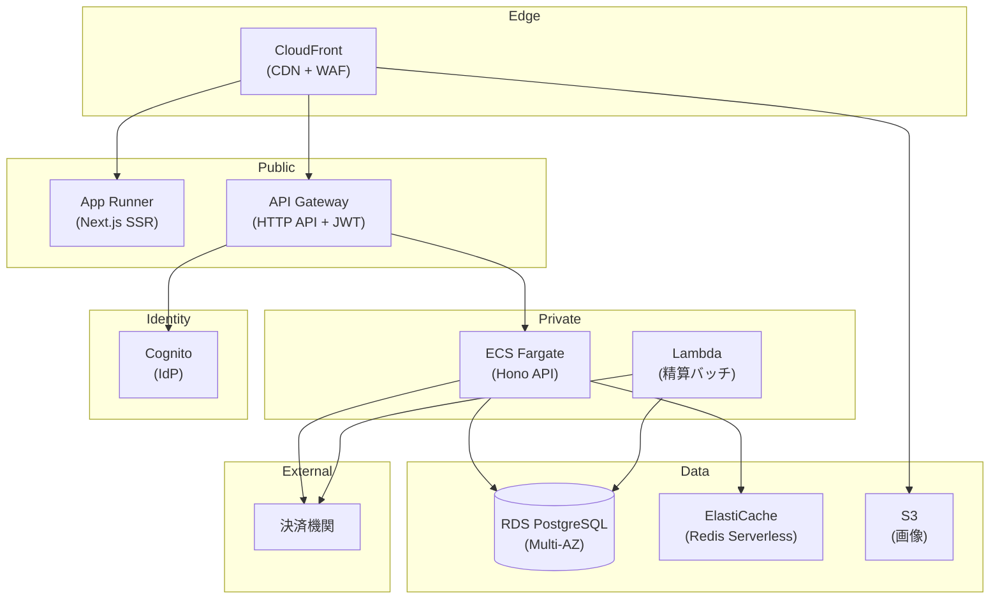
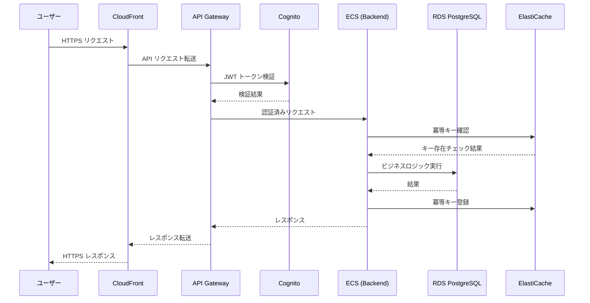
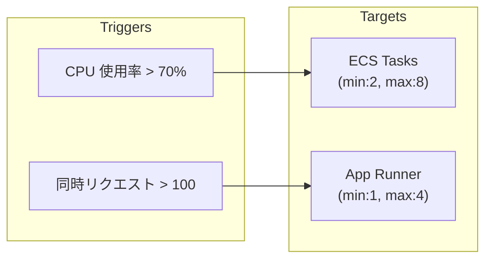

# 貸し会議室サービス - AWS アーキテクチャ

## 概要

C2C 会議室シェアリングサービスの AWS インフラストラクチャ設計。
3種のアクター（利用者・オーナー・運営担当者）が利用する Web アプリケーションと月末精算バッチ処理を含む。

| 項目 | 値 |
|------|-----|
| ワークロードタイプ | Web App |
| SLA | 99% |
| フェイルオーバー | Warm Standby |
| レイテンシ p99 | 500ms |
| トラフィック | 50 RPS (定常)、ピーク 100 RPS |
| コスト戦略 | Balanced |
| 月額概算 | $800 - $1,500 |

## ワークロード全体構成図

## リクエストフロー図

## オートスケーリング構成図

## AWS サービスマッピング

| Canonical 要素 | AWS サービス | 構成 |
|---|---|---|
| Web Frontend | App Runner | Next.js SSR, 0.25 vCPU |
| API Gateway | API Gateway (HTTP API) | JWT + WAF + Rate Limit |
| IdP | Cognito | OAuth2/OIDC, パスワードポリシー |
| Backend API | ECS Fargate | Hono, 0.5 vCPU, 2-8 タスク |
| Batch Worker | Lambda + EventBridge | 月末精算, arm64 |
| RDB | RDS PostgreSQL | Multi-AZ, db.r6g.large |
| Cache | ElastiCache Redis | Serverless |
| Object Storage | S3 | Standard + IA 移行 |
| CDN | CloudFront | PriceClass_200 |
| Network | VPC | 3サブネット層, NAT GW |

## セキュリティ構成

- **認証**: Cognito (OAuth2/OIDC) + API Gateway JWT 検証
- **認可**: RBAC (利用者/オーナー/運営) + Backend 細粒度制御
- **暗号化**: TLS (全通信) + KMS (RDS ストレージ)
- **ネットワーク分離**: Public/Private/DB サブネット
- **WAF**: CloudFront + API Gateway に適用 (OWASP Top10)
- **監査**: CloudWatch Logs (365日保持)

## コスト最適化ポイント

1. ARM64 (Graviton) 採用で ~20% 削減
2. VPC エンドポイントで NAT Gateway コスト削減
3. ElastiCache Serverless で使用量ベース課金
4. S3 ライフサイクルで IA 移行
5. 本番安定後に RI / Savings Plans 適用
