# データストアスキーマ

## サマリー

| データストア | 項目数 |
|------------|:------:|
| RDB テーブル | 14 |
| RDB インデックス | 24 |
| RDB 外部キー | 11 |
| KVS キーパターン | 6 |

## RDB

### ER 図

```mermaid
erDiagram
owners ||--o{ rooms : "所有"
owners ||--o{ settlements : "精算"
owners ||--o{ sales_records : "売上"
rooms ||--|| operation_rules : "運用ルール"
rooms ||--o{ keys : "鍵"
rooms ||--o{ reservations : "予約"
rooms ||--o{ commissions : "手数料"
users ||--o{ reservations : "予約"
reservations ||--o{ room_reviews : "評価"
reservations ||--o{ user_reviews : "利用者評価"
reservations ||--o{ usage_history : "利用履歴"
```

### テーブル一覧

| テーブル名 | RDRA 情報 | 説明 | カラム数 | インデックス数 | 利用 UC 数 |
|-----------|----------|------|:-------:|:----------:|:--------:|
| owners | オーナー情報 | 会議室オーナーのプロフィール情報を管理する | 8 | 2 | 6 |
| service_terms | サービス規約 | サービス利用規約。SCD2方式で世代管理する | 6 | 1 | 1 |
| rooms | 会議室情報 | 会議室の物件情報を管理する | 11 | 3 | 4 |
| operation_rules | 運用ルール | 会議室ごとの運用ルールを管理する | 5 | 1 | 1 |
| keys | 鍵情報 | 会議室の鍵の貸出・返却状態を管理する | 4 | 1 | 3 |
| reservations | 予約情報 | 会議室の予約情報を管理する。event_snapshot型 | 11 | 3 | 6 |
| users | 利用者情報 | 利用者のアカウント情報を管理する | 5 | 1 | 2 |
| room_reviews | 会議室評価 | 利用者からの会議室・ホスト評価を管理する。event型(追記のみ) | 8 | 2 | 5 |
| user_reviews | 利用者評価 | オーナーが利用者に付けた評価を管理する | 7 | 2 | 2 |
| inquiries | 問合せ | 利用者からの問合せと回答を管理する | 10 | 2 | 4 |
| commissions | 手数料情報 | サービス運営の手数料情報を管理する | 5 | 1 | 2 |
| usage_history | 利用履歴 | 会議室の利用履歴を管理する | 7 | 2 | 4 |
| sales_records | 売上実績 | オーナーの会議室別売上実績を管理する | 5 | 1 | 1 |
| settlements | 精算情報 | オーナーへの精算情報を管理する | 9 | 2 | 3 |

### owners

**RDRA 情報**: オーナー情報
**説明**: 会議室オーナーのプロフィール情報を管理する

#### カラム

| カラム名 | 型 | NULL | 説明 |
|---------|---|:----:|------|
| **owner_id** (PK) | uuid | NO | オーナーID。主キー |
| name | string | NO | 氏名。個人情報暗号化対象 |
| email | string | NO | メールアドレス。個人情報暗号化対象。ユニーク制約 |
| phone | string | NO | 電話番号。個人情報暗号化対象 |
| profile | text | YES | プロフィール自由記述 |
| current_status | string | NO | オーナー申請状態。値: 未申請, 申請中, 審査中, 承認, 却下, 退会 |
| registered_at | datetime | NO | 登録日時 |
| updated_at | datetime | NO | 最終更新日時 |

#### インデックス

| 名前 | カラム | UNIQUE | 理由 | 利用 UC |
|------|-------|:------:|------|--------|
| uq_owners_email | email | YES | ユニーク制約: メールアドレスの一意性を保証 | オーナーを登録する |
| idx_owners_status | current_status | NO | 申請状態でのフィルター検索 | オーナー登録を審査する |

#### 利用 UC

| UC | 操作 |
|---|------|
| オーナーを登録する | INSERT |
| オーナー申請する | UPDATE |
| オーナー登録を審査する | SELECT, UPDATE |
| プロフィールを編集する | SELECT, UPDATE |
| オーナー退会する | UPDATE |
| 退会を処理する | SELECT, UPDATE |

### service_terms

**RDRA 情報**: サービス規約
**説明**: サービス利用規約。SCD2方式で世代管理する

#### カラム

| カラム名 | 型 | NULL | 説明 |
|---------|---|:----:|------|
| **terms_id** (PK) | uuid | NO | 規約ID。主キー |
| terms_name | string | NO | 規約名 |
| content | text | NO | 規約本文 |
| effective_date | date | NO | 適用開始日 |
| valid_from | datetime | NO | SCD2 世代開始日時 |
| valid_to | datetime | YES | SCD2 世代終了日時。NULLは現行世代 |

#### インデックス

| 名前 | カラム | UNIQUE | 理由 | 利用 UC |
|------|-------|:------:|------|--------|
| idx_service_terms_valid | valid_from, valid_to | NO | 有効期間による現行規約の取得 | 規約を参照する |

#### 利用 UC

| UC | 操作 |
|---|------|
| 規約を参照する | SELECT |

### rooms

**RDRA 情報**: 会議室情報
**説明**: 会議室の物件情報を管理する

#### カラム

| カラム名 | 型 | NULL | 説明 |
|---------|---|:----:|------|
| **room_id** (PK) | uuid | NO | 会議室ID。主キー |
| room_name | string | NO | 会議室名 |
| area | decimal | NO | 広さ(平方メートル) |
| price | decimal | NO | 価格(円/時) |
| features | text | YES | 機能性の説明 |
| location | string | NO | 所在地 |
| image_url | string | YES | 会議室画像URL |
| availability | boolean | NO | 貸出可否。true=貸出可 |
| owner_id | uuid | NO | 所有オーナーID。外部キー |
| created_at | datetime | NO | 登録日時 |
| updated_at | datetime | NO | 最終更新日時 |

#### 外部キー

| カラム | 参照先テーブル | 参照先カラム | ON DELETE |
|-------|-------------|------------|----------|
| owner_id | owners | owner_id | CASCADE |

#### インデックス

| 名前 | カラム | UNIQUE | 理由 | 利用 UC |
|------|-------|:------:|------|--------|
| fk_rooms_owners | owner_id | NO | オーナーIDによる会議室一覧取得 | 会議室を登録する, 会議室評価を確認する |
| idx_rooms_availability_price | availability, price | NO | 貸出可能な会議室の価格順検索 | 会議室を照会する |
| idx_rooms_area | area | NO | 広さによるフィルター検索 | 会議室を照会する |

#### 利用 UC

| UC | 操作 |
|---|------|
| 会議室を登録する | INSERT |
| 会議室を照会する | SELECT |
| 会議室を予約する | SELECT |
| 利用状況を分析する | SELECT |

### operation_rules

**RDRA 情報**: 運用ルール
**説明**: 会議室ごとの運用ルールを管理する

#### カラム

| カラム名 | 型 | NULL | 説明 |
|---------|---|:----:|------|
| **rule_id** (PK) | uuid | NO | ルールID。主キー |
| cancel_policy | text | NO | キャンセルポリシー |
| availability | boolean | NO | 貸出可否 |
| available_hours | string | NO | 利用時間帯 |
| room_id | uuid | NO | 対象会議室ID。外部キー |

#### 外部キー

| カラム | 参照先テーブル | 参照先カラム | ON DELETE |
|-------|-------------|------------|----------|
| room_id | rooms | room_id | CASCADE |

#### インデックス

| 名前 | カラム | UNIQUE | 理由 | 利用 UC |
|------|-------|:------:|------|--------|
| uq_operation_rules_room_id | room_id | YES | ユニーク制約: 1会議室につき1運用ルール | 運用ルールを設定する |

#### 利用 UC

| UC | 操作 |
|---|------|
| 運用ルールを設定する | INSERT, UPDATE |

### keys

**RDRA 情報**: 鍵情報
**説明**: 会議室の鍵の貸出・返却状態を管理する

#### カラム

| カラム名 | 型 | NULL | 説明 |
|---------|---|:----:|------|
| **key_id** (PK) | uuid | NO | 鍵ID。主キー |
| key_type | string | NO | 鍵種別 |
| current_status | string | NO | 貸出状態。値: 利用可, 貸出中, 返却済 |
| room_id | uuid | NO | 対象会議室ID。外部キー |

#### 外部キー

| カラム | 参照先テーブル | 参照先カラム | ON DELETE |
|-------|-------------|------------|----------|
| room_id | rooms | room_id | CASCADE |

#### インデックス

| 名前 | カラム | UNIQUE | 理由 | 利用 UC |
|------|-------|:------:|------|--------|
| fk_keys_rooms | room_id | NO | 会議室IDによる鍵一覧取得 | 鍵を受け取る, 鍵を貸出する, 鍵を返却する |

#### 利用 UC

| UC | 操作 |
|---|------|
| 鍵を受け取る | SELECT, UPDATE |
| 鍵を貸出する | SELECT, UPDATE |
| 鍵を返却する | SELECT, UPDATE |

### reservations

**RDRA 情報**: 予約情報
**説明**: 会議室の予約情報を管理する。event_snapshot型

#### カラム

| カラム名 | 型 | NULL | 説明 |
|---------|---|:----:|------|
| **reservation_id** (PK) | uuid | NO | 予約ID。主キー |
| start_datetime | datetime | NO | 利用開始日時 |
| end_datetime | datetime | NO | 利用終了日時 |
| payment_method | string | NO | 決済方法。値: クレジットカード, 電子マネー |
| usage_fee | decimal | NO | 利用料金(円) |
| current_status | string | NO | 予約状態。値: 仮予約, 確定, 変更, 利用中, 利用完了, 取消 |
| room_id | uuid | NO | 対象会議室ID。外部キー |
| user_id | uuid | NO | 利用者ID。外部キー |
| idempotency_key | uuid | NO | 冪等キー。重複予約防止 |
| created_at | datetime | NO | 作成日時 |
| updated_at | datetime | NO | 最終更新日時 |

#### 外部キー

| カラム | 参照先テーブル | 参照先カラム | ON DELETE |
|-------|-------------|------------|----------|
| room_id | rooms | room_id | RESTRICT |
| user_id | users | user_id | RESTRICT |

#### インデックス

| 名前 | カラム | UNIQUE | 理由 | 利用 UC |
|------|-------|:------:|------|--------|
| uq_reservations_idempotency_key | idempotency_key | YES | ユニーク制約: 冪等キーによる重複予約防止 | 会議室を予約する |
| idx_reservations_room_start | room_id, start_datetime | NO | 会議室の予約一覧取得(日時順) | 会議室を予約する, 予約を変更する |
| idx_reservations_user_status | user_id, current_status | NO | 利用者の予約状態別一覧取得 | 予約を変更する, 予約を取消する |

#### 利用 UC

| UC | 操作 |
|---|------|
| 会議室を予約する | INSERT |
| 予約を変更する | SELECT, UPDATE |
| 予約を取消する | SELECT, UPDATE |
| 利用許諾を判定する | SELECT, UPDATE |
| 鍵を貸出する | SELECT, UPDATE |
| 鍵を返却する | SELECT, UPDATE |

### users

**RDRA 情報**: 利用者情報
**説明**: 利用者のアカウント情報を管理する

#### カラム

| カラム名 | 型 | NULL | 説明 |
|---------|---|:----:|------|
| **user_id** (PK) | uuid | NO | 利用者ID。主キー |
| name | string | NO | 氏名。個人情報暗号化対象 |
| email | string | NO | メールアドレス。個人情報暗号化対象。ユニーク制約 |
| phone | string | NO | 電話番号。個人情報暗号化対象 |
| registered_at | datetime | NO | 登録日時 |

#### インデックス

| 名前 | カラム | UNIQUE | 理由 | 利用 UC |
|------|-------|:------:|------|--------|
| uq_users_email | email | YES | ユニーク制約: メールアドレスの一意性を保証 | 会議室を照会する |

#### 利用 UC

| UC | 操作 |
|---|------|
| 会議室を照会する | SELECT |
| 会議室を予約する | SELECT |

### room_reviews

**RDRA 情報**: 会議室評価
**説明**: 利用者からの会議室・ホスト評価を管理する。event型(追記のみ)

#### カラム

| カラム名 | 型 | NULL | 説明 |
|---------|---|:----:|------|
| **review_id** (PK) | uuid | NO | 評価ID。主キー |
| reviewer_id | uuid | NO | 評価者ID(利用者ID) |
| target_id | uuid | NO | 評価対象ID(会議室IDまたはオーナーID) |
| review_type | string | NO | 評価種別。値: 会議室評価, ホスト評価 |
| reservation_id | uuid | NO | 関連予約ID |
| score | decimal | NO | 評価点(1.0-5.0) |
| comment | text | YES | 評価コメント |
| created_at | datetime | NO | 評価日時 |

#### 外部キー

| カラム | 参照先テーブル | 参照先カラム | ON DELETE |
|-------|-------------|------------|----------|
| reservation_id | reservations | reservation_id | RESTRICT |

#### インデックス

| 名前 | カラム | UNIQUE | 理由 | 利用 UC |
|------|-------|:------:|------|--------|
| uq_room_reviews_reservation_type | reservation_id, review_type | YES | ユニーク制約: 1予約につき評価種別ごとに1件のみ | 会議室を評価する, ホストを評価する |
| idx_room_reviews_target | target_id, review_type | NO | 評価対象別の評価一覧取得 | 会議室評価を確認する, 評価結果を確認する |

#### 利用 UC

| UC | 操作 |
|---|------|
| 会議室を評価する | INSERT |
| ホストを評価する | INSERT |
| 会議室評価を確認する | SELECT |
| 評価結果を確認する | SELECT |
| 会議室を照会する | SELECT |

### user_reviews

**RDRA 情報**: 利用者評価
**説明**: オーナーが利用者に付けた評価を管理する

#### カラム

| カラム名 | 型 | NULL | 説明 |
|---------|---|:----:|------|
| **review_id** (PK) | uuid | NO | 評価ID。主キー |
| reviewer_id | uuid | NO | 評価者ID(オーナーID) |
| target_user_id | uuid | NO | 評価対象利用者ID |
| reservation_id | uuid | NO | 関連予約ID |
| score | decimal | NO | 評価点(1.0-5.0) |
| comment | text | YES | 評価コメント |
| created_at | datetime | NO | 評価日時 |

#### 外部キー

| カラム | 参照先テーブル | 参照先カラム | ON DELETE |
|-------|-------------|------------|----------|
| reservation_id | reservations | reservation_id | RESTRICT |

#### インデックス

| 名前 | カラム | UNIQUE | 理由 | 利用 UC |
|------|-------|:------:|------|--------|
| uq_user_reviews_reservation | reservation_id | YES | ユニーク制約: 1予約につき利用者評価は1件のみ | 利用者を評価する |
| idx_user_reviews_target | target_user_id | NO | 利用者IDによる評価一覧取得(利用許諾判定用) | 利用許諾を判定する |

#### 利用 UC

| UC | 操作 |
|---|------|
| 利用者を評価する | INSERT |
| 利用許諾を判定する | SELECT |

### inquiries

**RDRA 情報**: 問合せ
**説明**: 利用者からの問合せと回答を管理する

#### カラム

| カラム名 | 型 | NULL | 説明 |
|---------|---|:----:|------|
| **inquiry_id** (PK) | uuid | NO | 問合せID。主キー |
| inquiry_type | string | NO | 問合せ種別。値: 会議室問合せ, サービス問合せ |
| content | text | NO | 問合せ内容 |
| reply_content | text | YES | 回答内容 |
| current_status | string | NO | 問合せ状態。値: 受付, 対応中, 回答済, 完了 |
| sender_id | uuid | NO | 送信者ID(利用者ID) |
| receiver_id | uuid | NO | 受信者ID(オーナーIDまたは運営担当者ID) |
| reservation_id | uuid | YES | 関連予約ID(任意) |
| created_at | datetime | NO | 問合せ日時 |
| replied_at | datetime | YES | 回答日時 |

#### インデックス

| 名前 | カラム | UNIQUE | 理由 | 利用 UC |
|------|-------|:------:|------|--------|
| idx_inquiries_receiver_status | receiver_id, current_status | NO | 受信者別・状態別の問合せ一覧取得 | 問合せに回答する, サービス問合せに回答する |
| idx_inquiries_sender | sender_id | NO | 送信者の問合せ一覧取得 | オーナーに問合せる, サービスに問合せる |

#### 利用 UC

| UC | 操作 |
|---|------|
| オーナーに問合せる | INSERT |
| 問合せに回答する | SELECT, UPDATE |
| サービスに問合せる | INSERT |
| サービス問合せに回答する | SELECT, UPDATE |

### commissions

**RDRA 情報**: 手数料情報
**説明**: サービス運営の手数料情報を管理する

#### カラム

| カラム名 | 型 | NULL | 説明 |
|---------|---|:----:|------|
| **commission_id** (PK) | uuid | NO | 手数料ID。主キー |
| period | string | NO | 対象期間 |
| room_id | uuid | NO | 会議室ID |
| commission_rate | decimal | NO | 手数料率 |
| commission_amount | decimal | NO | 手数料額(円) |

#### 外部キー

| カラム | 参照先テーブル | 参照先カラム | ON DELETE |
|-------|-------------|------------|----------|
| room_id | rooms | room_id | RESTRICT |

#### インデックス

| 名前 | カラム | UNIQUE | 理由 | 利用 UC |
|------|-------|:------:|------|--------|
| idx_commissions_room_period | room_id, period | NO | 会議室別・期間別の手数料集計 | 手数料売上を分析する, 精算額を計算する |

#### 利用 UC

| UC | 操作 |
|---|------|
| 手数料売上を分析する | SELECT |
| 精算額を計算する | SELECT |

### usage_history

**RDRA 情報**: 利用履歴
**説明**: 会議室の利用履歴を管理する

#### カラム

| カラム名 | 型 | NULL | 説明 |
|---------|---|:----:|------|
| **history_id** (PK) | uuid | NO | 履歴ID。主キー |
| user_id | uuid | NO | 利用者ID |
| room_id | uuid | NO | 会議室ID |
| usage_datetime | datetime | NO | 利用日時 |
| usage_hours | decimal | NO | 利用時間 |
| usage_fee | decimal | NO | 利用料金(円) |
| reservation_id | uuid | NO | 関連予約ID |

#### 外部キー

| カラム | 参照先テーブル | 参照先カラム | ON DELETE |
|-------|-------------|------------|----------|
| reservation_id | reservations | reservation_id | RESTRICT |

#### インデックス

| 名前 | カラム | UNIQUE | 理由 | 利用 UC |
|------|-------|:------:|------|--------|
| idx_usage_history_room | room_id, usage_datetime | NO | 会議室別の利用履歴取得(日時順) | 利用状況を分析する, 精算額を計算する |
| idx_usage_history_user | user_id | NO | 利用者別の利用履歴取得 | 利用履歴を管理する |

#### 利用 UC

| UC | 操作 |
|---|------|
| 利用履歴を管理する | SELECT |
| 利用状況を分析する | SELECT |
| 手数料売上を分析する | SELECT |
| 精算額を計算する | SELECT |

### sales_records

**RDRA 情報**: 売上実績
**説明**: オーナーの会議室別売上実績を管理する

#### カラム

| カラム名 | 型 | NULL | 説明 |
|---------|---|:----:|------|
| **sales_id** (PK) | uuid | NO | 売上ID。主キー |
| owner_id | uuid | NO | オーナーID |
| room_id | uuid | NO | 会議室ID |
| period | string | NO | 対象期間 |
| sales_amount | decimal | NO | 売上金額(円) |

#### 外部キー

| カラム | 参照先テーブル | 参照先カラム | ON DELETE |
|-------|-------------|------------|----------|
| owner_id | owners | owner_id | RESTRICT |

#### インデックス

| 名前 | カラム | UNIQUE | 理由 | 利用 UC |
|------|-------|:------:|------|--------|
| idx_sales_records_owner_period | owner_id, period | NO | オーナー別・期間別の売上集計 | 精算結果を確認する |

#### 利用 UC

| UC | 操作 |
|---|------|
| 精算結果を確認する | SELECT |

### settlements

**RDRA 情報**: 精算情報
**説明**: オーナーへの精算情報を管理する

#### カラム

| カラム名 | 型 | NULL | 説明 |
|---------|---|:----:|------|
| **settlement_id** (PK) | uuid | NO | 精算ID。主キー |
| owner_id | uuid | NO | オーナーID |
| period | string | NO | 対象期間 |
| total_usage_fee | decimal | NO | 利用料合計(円) |
| commission | decimal | NO | 手数料(円) |
| payout_amount | decimal | NO | 支払額(円) |
| settlement_date | date | YES | 精算日 |
| status | string | NO | 精算状態。値: pending, calculated, executed, failed |
| idempotency_key | uuid | NO | 冪等キー。二重精算防止 |

#### 外部キー

| カラム | 参照先テーブル | 参照先カラム | ON DELETE |
|-------|-------------|------------|----------|
| owner_id | owners | owner_id | RESTRICT |

#### インデックス

| 名前 | カラム | UNIQUE | 理由 | 利用 UC |
|------|-------|:------:|------|--------|
| uq_settlements_idempotency_key | idempotency_key | YES | ユニーク制約: 冪等キーによる二重精算防止 | 精算を実行する |
| idx_settlements_owner_period | owner_id, period | NO | オーナー別・期間別の精算取得 | 精算結果を確認する |

#### 利用 UC

| UC | 操作 |
|---|------|
| 精算額を計算する | INSERT, UPDATE |
| 精算を実行する | SELECT, UPDATE |
| 精算結果を確認する | SELECT |

## KVS

| キーパターン | 用途 | 値の型 | TTL | 利用 UC |
|------------|------|-------|-----|--------|
| `session:user:{user_id}` | session | JSON (session data) | 24h | 会議室を照会する, 会議室を予約する |
| `session:owner:{owner_id}` | session | JSON (session data) | 24h | 会議室を登録する, 利用許諾を判定する |
| `session:admin:{admin_id}` | session | JSON (session data) | 8h | オーナー登録を審査する, 精算額を計算する |
| `idempotency:{idempotency_key}` | lock | JSON (previous response) | 24h | 会議室を予約する, 精算を実行する |
| `cache:room:{room_id}` | cache | JSON (room detail) | 15m | 会議室を照会する |
| `ratelimit:{actor_type}:{actor_id}` | rate-limit | integer (request count) | 1m | 会議室を照会する |

### `session:user:{user_id}`

- **用途**: session
- **値の型**: JSON (session data)
- **TTL**: 24h
- **説明**: 利用者セッションデータ。ログイン後24時間有効
- **利用 UC**: 会議室を照会する, 会議室を予約する

### `session:owner:{owner_id}`

- **用途**: session
- **値の型**: JSON (session data)
- **TTL**: 24h
- **説明**: オーナーセッションデータ。ログイン後24時間有効
- **利用 UC**: 会議室を登録する, 利用許諾を判定する

### `session:admin:{admin_id}`

- **用途**: session
- **値の型**: JSON (session data)
- **TTL**: 8h
- **説明**: 管理者セッションデータ。ログイン後8時間有効
- **利用 UC**: オーナー登録を審査する, 精算額を計算する

### `idempotency:{idempotency_key}`

- **用途**: lock
- **値の型**: JSON (previous response)
- **TTL**: 24h
- **説明**: 冪等キー管理。重複リクエストの検知と前回レスポンスの返却
- **利用 UC**: 会議室を予約する, 精算を実行する

### `cache:room:{room_id}`

- **用途**: cache
- **値の型**: JSON (room detail)
- **TTL**: 15m
- **説明**: 会議室詳細キャッシュ。15分有効
- **利用 UC**: 会議室を照会する

### `ratelimit:{actor_type}:{actor_id}`

- **用途**: rate-limit
- **値の型**: integer (request count)
- **TTL**: 1m
- **説明**: APIレート制限カウンター。1分あたりのリクエスト数
- **利用 UC**: 会議室を照会する
