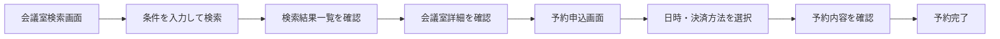
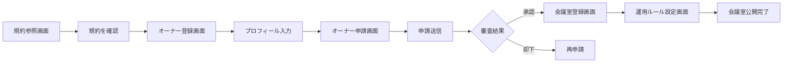
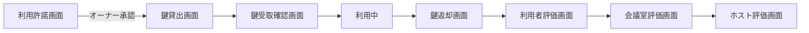
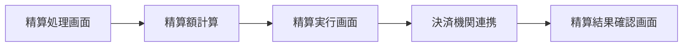
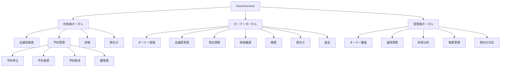

# UX デザイン仕様

## ユーザーフロー

### 予約業務: 会議室検索から予約完了まで

**アクター**: 利用者
**ゴール**: 条件に合った会議室を見つけて予約を確定する

**タッチポイント**:
| ステップ | 画面 | UC | 感情 | 改善機会 |
|---------|------|---|------|---------|
| 条件入力 | 会議室検索画面 | 会議室を照会する | ニュートラル | フィルター初期値をよく使う条件にプリセット |
| 結果一覧確認 | 会議室検索画面 | 会議室を照会する | ポジティブ/ネガティブ | 該当0件時に条件緩和を提案 |
| 詳細確認 | 会議室検索画面 | 会議室を照会する | ポジティブ | 評価・画像で信頼性を訴求 |
| 予約申込 | 予約申込画面 | 会議室を予約する | ニュートラル | カレンダーで空き状況を視覚的に表示 |
| 予約完了 | 予約申込画面 | 会議室を予約する | ポジティブ | 完了メッセージで次のステップを案内 |

### オーナー管理業務: オーナー登録から会議室公開まで

**アクター**: 会議室オーナー
**ゴール**: サービスに登録し、会議室を公開して貸出可能にする

**タッチポイント**:
| ステップ | 画面 | UC | 感情 | 改善機会 |
|---------|------|---|------|---------|
| 規約確認 | 規約参照画面 | 規約を参照する | ニュートラル | 要点をハイライト表示 |
| プロフィール入力 | オーナー登録画面 | オーナーを登録する | ニュートラル | 入力補助とリアルタイムバリデーション |
| 申請送信 | オーナー申請画面 | オーナー申請する | 不安 | 審査所要時間の明示 |
| 審査待ち | - | - | 不安 | 進捗ステータスの通知 |
| 会議室登録 | 会議室登録画面 | 会議室を登録する | ポジティブ | プレビュー機能で公開イメージを確認 |

### 会議室貸出業務: 予約確定から利用完了まで

**アクター**: 利用者, 会議室オーナー
**ゴール**: 予約した会議室を円滑に利用し、相互評価を完了する

**タッチポイント**:
| ステップ | 画面 | UC | 感情 | 改善機会 |
|---------|------|---|------|---------|
| 利用許諾 | 利用許諾画面 | 利用許諾を判定する | ニュートラル | 利用者評価を分かりやすく表示 |
| 鍵受取 | 鍵受取確認画面 | 鍵を受け取る | ポジティブ | QRコード等でスムーズな受渡し |
| 鍵返却 | 鍵返却画面 | 鍵を返却する | ニュートラル | 返却完了の即時確認 |
| 相互評価 | 各評価画面 | 各評価UC | ニュートラル | 星評価のみで手軽に完了可能 |

### 精算業務: 月末精算フロー

**アクター**: サービス運営担当者, 会議室オーナー
**ゴール**: 正確な精算額を算出しオーナーに支払う

**タッチポイント**:
| ステップ | 画面 | UC | 感情 | 改善機会 |
|---------|------|---|------|---------|
| 精算額確認 | 精算処理画面 | 精算額を計算する | ニュートラル | 明細の内訳を分かりやすく表示 |
| 精算実行 | 精算実行画面 | 精算を実行する | 緊張 | 実行前確認ダイアログで誤操作防止 |
| 結果確認 | 精算結果確認画面 | 精算結果を確認する | ポジティブ | 過去精算との比較表示 |

## 情報アーキテクチャ（IA）

### サイトマップ

### ナビゲーション構造

| ポータル | プライマリナビ | セカンダリナビ |
|---------|-------------|-------------|
| 利用者ポータル | 会議室検索, 予約一覧, 評価, 問合せ, サポート | 予約詳細, 鍵受取, 評価入力 |
| オーナーポータル | ダッシュボード, 会議室管理, 予約管理, 評価, 精算, 問合せ, プロフィール | 運用ルール, 鍵管理, 利用者評価 |
| 管理者ポータル | ダッシュボード, オーナー管理, 利用分析, 手数料分析, 精算管理, 問合せ対応 | オーナー審査, 退会処理, 利用履歴 |

### ページ間の遷移ルール

- 認証なしでアクセス可能なページ: 会議室検索画面のみ（閲覧のみ。予約には認証が必要）
- 認証後リダイレクト: ログイン前にアクセスしたURLへリダイレクト
- ポータル間遷移: 同一ユーザーが複数ロールを持つ場合、ポータル切替メニューを表示
- パンくずリスト: 全ページで階層構造に基づくパンくずリストを表示
- エラーページ: 403(権限なし), 404(ページなし), 500(サーバーエラー) を専用ページで表示

## UX 心理学に基づくインタラクション設計原則

### 適用する原則

| 原則 | 適用場面 | 具体的な設計 |
|------|---------|-----------|
| ヤコブの法則 | 全ポータル | 一般的なWebアプリのレイアウト慣例に従う（サイドバー+メイン、ヘッダー固定） |
| ヒックの法則 | 会議室検索フィルター | フィルター項目を必要最小限に絞り、追加条件は折りたたみに格納 |
| フィッツの法則 | 予約・申請ボタン | 主要CTAボタンは十分な大きさ(48px以上)で視覚的に目立つ位置に配置 |
| ミラーの法則 | ダッシュボード画面 | 表示KPI数を5個以下にまとめ、ワーキングメモリの限界を超えない |
| ドハティの閾値 | API応答待ち | 400ms以内に応答がない場合はSkeletonローディングを表示 |
| ゼイガルニク効果 | オーナー登録フロー | 登録ステップの進捗バーを表示し、完了への動機付けを維持 |
| ピークエンドの法則 | 予約完了、精算完了 | 完了画面でポジティブなメッセージと次のアクション案内を表示 |
| 社会的証明 | 会議室検索結果 | 評価点・レビュー数を目立つ位置に配置し、信頼性を訴求 |

## アクセシビリティ方針

- **WCAG 準拠レベル**: AA
- **キーボード操作**: 全インタラクティブ要素にフォーカスリングを表示。Tab順序は視覚的な配置に一致
- **スクリーンリーダー**: 全画面にaria-label/aria-describedbyを適切に設定。動的コンテンツ更新時にaria-liveで通知
- **色覚多様性**: 色のみで情報を伝達しない。ステータスバッジにはアイコンまたはテキストを併用
- **テキストサイズ**: 最小14px(0.875rem)。ユーザーが200%まで拡大可能な設計
