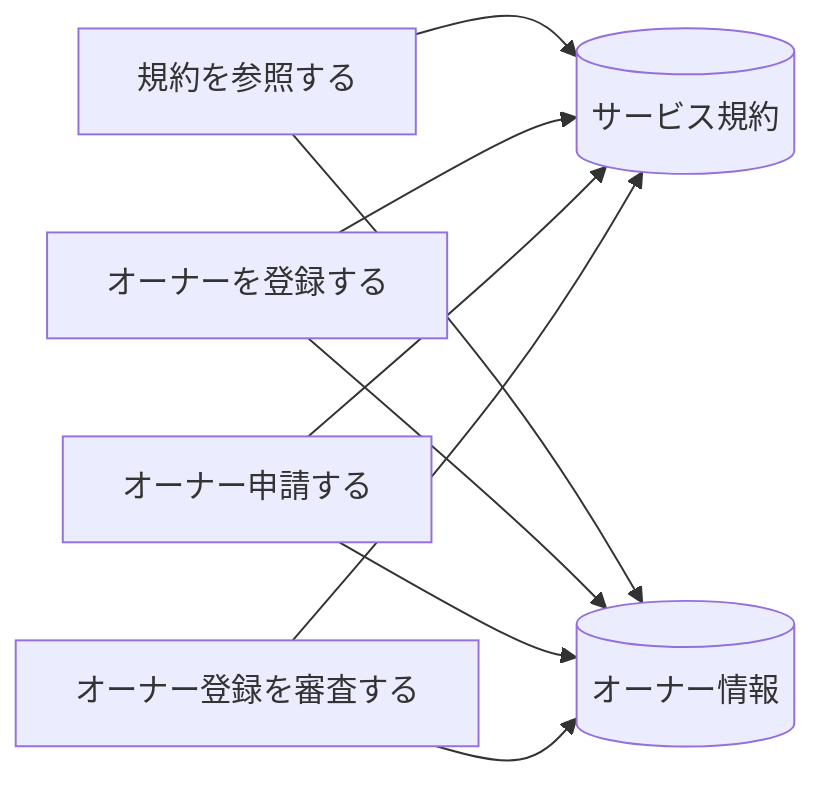
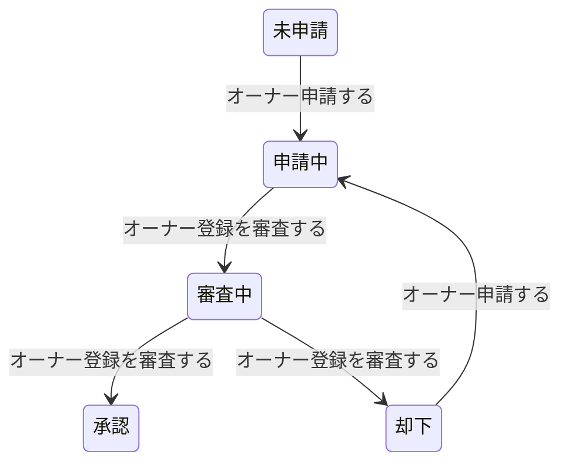

# オーナー登録フロー - BUC 俯瞰仕様

## 所属 UC 一覧

| # | UC名 | アクティビティ | 概要 |
|---|------|-------------|------|
| 1 | [規約を参照する](規約を参照する/spec.md) | 規約を参照する | 規約を参照する |
| 2 | [オーナーを登録する](オーナーを登録する/spec.md) | オーナーを登録する | オーナーを登録する |
| 3 | [オーナー申請する](オーナー申請する/spec.md) | オーナー申請する | オーナー申請する |
| 4 | [オーナー登録を審査する](オーナー登録を審査する/spec.md) | オーナー登録を審査する | オーナー登録を審査する |

## UC 横断データフロー

### 情報 CRUD マトリクス

| 情報 | 規約を参照する | オーナーを登録する | オーナー申請する | オーナー登録を審査する |
|------|---|---|---|---|
| サービス規約 | R | C | C | C |
| オーナー情報 | R | C | C | C |

## 状態遷移全体図

### 状態遷移 UC マッピング

| 遷移 | 担当UC |
|------|-------|
| 未申請 -> 申請中 | オーナー申請する |
| 申請中 -> 審査中 | オーナー登録を審査する |
| 審査中 -> 承認 | オーナー登録を審査する |
| 審査中 -> 却下 | オーナー登録を審査する |
| 却下 -> 申請中 | オーナー申請する |

## BUC 内共有条件一覧

| 条件名 | 適用 UC |
|--------|--------|
| オーナー審査条件 | オーナー登録を審査する |

## BUC 内共有バリエーション一覧

| バリエーション名 | 適用 UC |
|----------------|--------|
| - | - |
