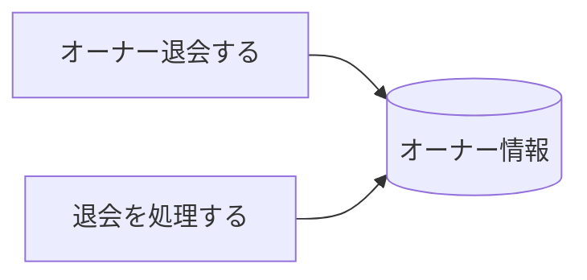
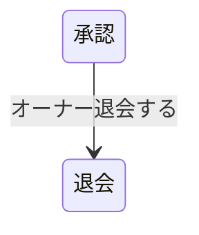

# オーナー退会フロー - BUC 俯瞰仕様

## 所属 UC 一覧

| # | UC名 | アクティビティ | 概要 |
|---|------|-------------|------|
| 1 | [オーナー退会する](オーナー退会する/spec.md) | オーナー退会する | オーナー退会する |
| 2 | [退会を処理する](退会を処理する/spec.md) | 退会を処理する | 退会を処理する |

## UC 横断データフロー

### 情報 CRUD マトリクス

| 情報 | オーナー退会する | 退会を処理する |
|------|---|---|
| オーナー情報 | UD | CU |

## 状態遷移全体図

### 状態遷移 UC マッピング

| 遷移 | 担当UC |
|------|-------|
| 承認 -> 退会 | オーナー退会する |

## BUC 内共有条件一覧

| 条件名 | 適用 UC |
|--------|--------|
| - | - |

## BUC 内共有バリエーション一覧

| バリエーション名 | 適用 UC |
|----------------|--------|
| - | - |
