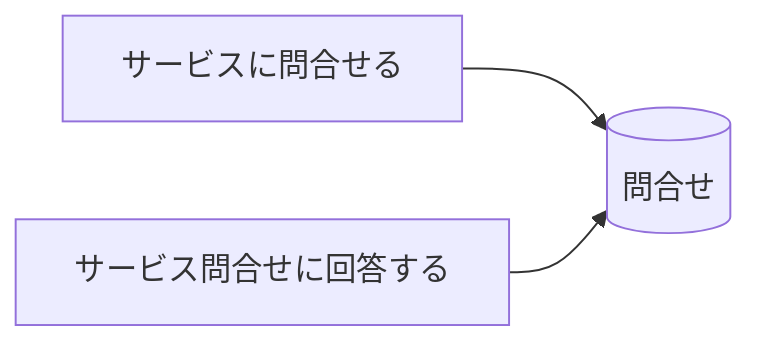
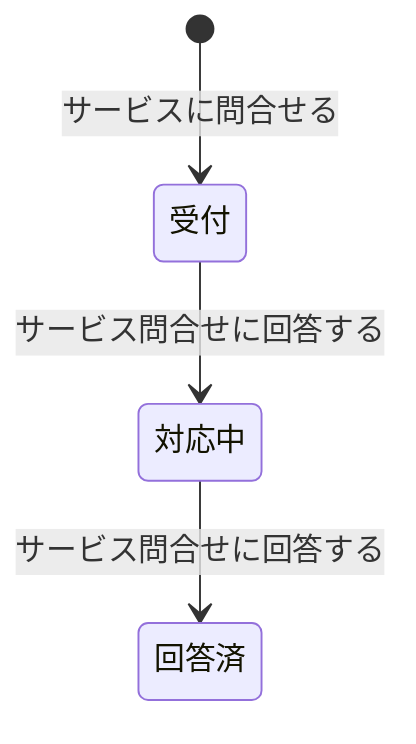

# サービス問合せ対応フロー - BUC 俯瞰仕様

## 所属 UC 一覧

| # | UC名 | アクティビティ | 概要 |
|---|------|-------------|------|
| 1 | [サービスに問合せる](サービスに問合せる/spec.md) | サービスに問合せる | サービスに問合せる |
| 2 | [サービス問合せに回答する](サービス問合せに回答する/spec.md) | サービス問合せに回答する | サービス問合せに回答する |

## UC 横断データフロー

### 情報 CRUD マトリクス

| 情報 | サービスに問合せる | サービス問合せに回答する |
|------|---|---|
| 問合せ | C | C |

## 状態遷移全体図

### 状態遷移 UC マッピング

| 遷移 | 担当UC |
|------|-------|
| (初期) -> 受付 | サービスに問合せる |
| 受付 -> 対応中 | サービス問合せに回答する |
| 対応中 -> 回答済 | サービス問合せに回答する |

## BUC 内共有条件一覧

| 条件名 | 適用 UC |
|--------|--------|
| - | - |

## BUC 内共有バリエーション一覧

| バリエーション名 | 適用 UC |
|----------------|--------|
| - | - |
