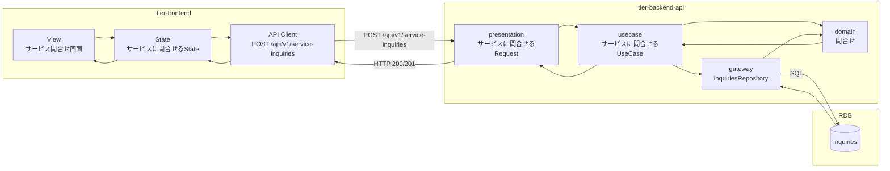
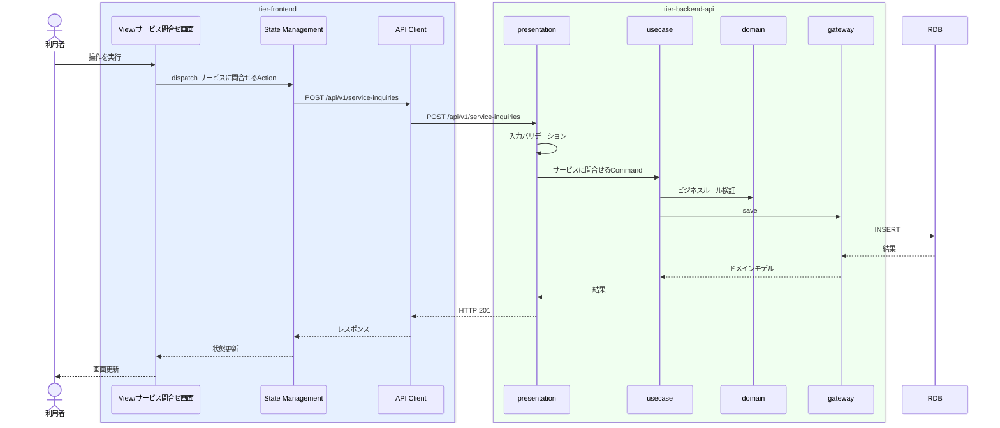

# サービスに問合せる

## 概要

サービス運営への問合せを送信する

## データフロー



| レイヤー | データモデル | 変換内容 |
|---------|------------|---------|
| FE View | サービス問合せ画面の入力/表示内容 | ユーザー操作をState/API呼び出しに変換 |
| BE presentation | サービスに問合せるRequest(問合せ) | 入力バリデーション + UseCase呼び出し |
| BE gateway | inquiries テーブル操作 | レコード作成 |
| Response | 操作結果 | 画面表示用データ |

## 処理フロー



## バリエーション一覧

| バリエーション名 | 値 | 処理内容 | 適用 tier | 適用箇所 |
|----------------|---|---------|----------|---------|
| 問合せ種別 | (バリエーション.tsvの値) | 表示切替/フィルター | tier-frontend | サービス問合せ画面 |


## 状態遷移一覧

| 状態モデル | 遷移元 | 遷移先 | トリガー | 事前条件 | 事後処理 | 適用 tier |
|-----------|--------|--------|---------|---------|---------|----------|
| 問合せ状態 | (初期) | 受付 | サービスに問合せる | 初期状態 | ステータス更新 | tier-backend-api |

## 関連 RDRA モデル

| モデル種別 | 要素名 | 関連 |
|-----------|--------|------|
| 業務 | サービス運営業務 | このUCが属する業務 |
| BUC | サービス問合せ対応フロー | このUCを含むBUC |
| アクター | 利用者 | 操作するアクター |
| 情報 | 問合せ | 更新する情報 |
| 状態 | 問合せ状態 | 初期 -> 受付 |


## E2E 完了条件（BDD）

### 正常系

```gherkin
Feature: サービスに問合せる

  Scenario: サービスに問合せるの正常実行
    Given 利用者「田中太郎」がログイン済みである
    When サービス問合せ画面で操作を実行する
    Then 操作が正常に完了し画面にフィードバックが表示される
```

### 異常系

```gherkin
  Scenario: 認証エラー
    Given 未ログイン状態である
    When サービス問合せ画面にアクセスする
    Then ログイン画面にリダイレクトされる

```

## ティア別仕様

- [フロントエンド](tier-frontend.md)
- [バックエンドAPI](tier-backend-api.md)

### 統合 API Spec

- [OpenAPI Spec](../../_cross-cutting/api/openapi.yaml)
