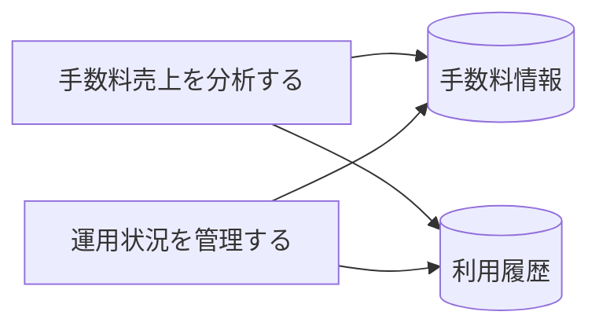

# サービス運営管理フロー - BUC 俯瞰仕様

## 所属 UC 一覧

| # | UC名 | アクティビティ | 概要 |
|---|------|-------------|------|
| 1 | [手数料売上を分析する](手数料売上を分析する/spec.md) | 手数料売上を分析する | 手数料売上を分析する |
| 2 | [運用状況を管理する](運用状況を管理する/spec.md) | 運用状況を管理する | 運用状況を管理する |

## UC 横断データフロー

### 情報 CRUD マトリクス

| 情報 | 手数料売上を分析する | 運用状況を管理する |
|------|---|---|
| 手数料情報 | R | R |
| 利用履歴 | R | R |

## 状態遷移全体図

状態遷移なし

### 状態遷移 UC マッピング

| - | - |

## BUC 内共有条件一覧

| 条件名 | 適用 UC |
|--------|--------|
| - | - |

## BUC 内共有バリエーション一覧

| バリエーション名 | 適用 UC |
|----------------|--------|
| - | - |
