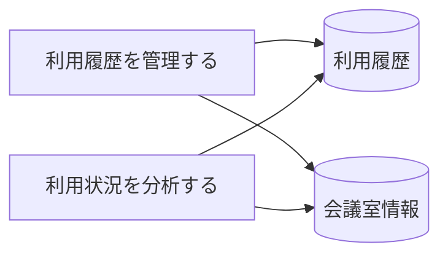

# 利用状況管理フロー - BUC 俯瞰仕様

## 所属 UC 一覧

| # | UC名 | アクティビティ | 概要 |
|---|------|-------------|------|
| 1 | [利用履歴を管理する](利用履歴を管理する/spec.md) | 利用履歴を管理する | 利用履歴を管理する |
| 2 | [利用状況を分析する](利用状況を分析する/spec.md) | 利用状況を分析する | 利用状況を分析する |

## UC 横断データフロー

### 情報 CRUD マトリクス

| 情報 | 利用履歴を管理する | 利用状況を分析する |
|------|---|---|
| 利用履歴 | R | R |
| 会議室情報 | R | R |

## 状態遷移全体図

状態遷移なし

### 状態遷移 UC マッピング

| - | - |

## BUC 内共有条件一覧

| 条件名 | 適用 UC |
|--------|--------|
| - | - |

## BUC 内共有バリエーション一覧

| バリエーション名 | 適用 UC |
|----------------|--------|
| - | - |
