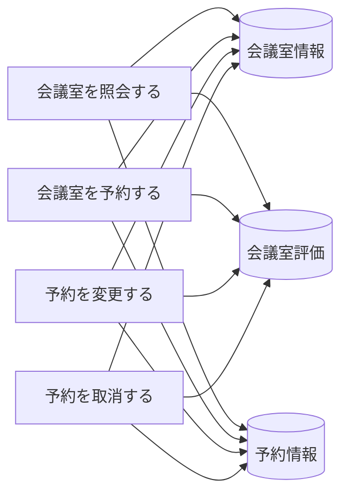
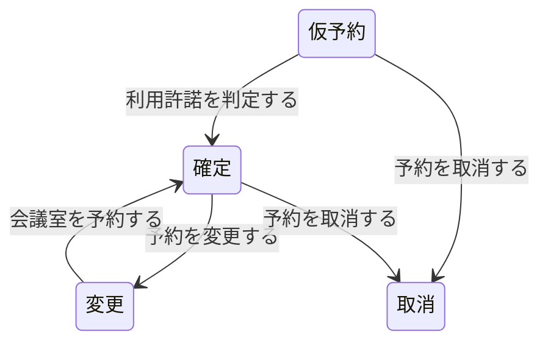

# 会議室予約フロー - BUC 俯瞰仕様

## 所属 UC 一覧

| # | UC名 | アクティビティ | 概要 |
|---|------|-------------|------|
| 1 | [会議室を照会する](会議室を照会する/spec.md) | 会議室を照会する | 会議室を照会する |
| 2 | [会議室を予約する](会議室を予約する/spec.md) | 会議室を予約する | 会議室を予約する |
| 3 | [予約を変更する](予約を変更する/spec.md) | 予約を変更する | 予約を変更する |
| 4 | [予約を取消する](予約を取消する/spec.md) | 予約を取消する | 予約を取消する |

## UC 横断データフロー

### 情報 CRUD マトリクス

| 情報 | 会議室を照会する | 会議室を予約する | 予約を変更する | 予約を取消する |
|------|---|---|---|---|
| 会議室情報 | R | R | CU | UD |
| 会議室評価 | R | R | CU | UD |
| 予約情報 | R | R | CU | UD |

## 状態遷移全体図

### 状態遷移 UC マッピング

| 遷移 | 担当UC |
|------|-------|
| 仮予約 -> 確定 | 利用許諾を判定する |
| 確定 -> 変更 | 予約を変更する |
| 変更 -> 確定 | 会議室を予約する |
| 仮予約 -> 取消 | 予約を取消する |
| 確定 -> 取消 | 予約を取消する |

## BUC 内共有条件一覧

| 条件名 | 適用 UC |
|--------|--------|
| 予約変更条件 | 予約を変更する, 予約を取消する |

## BUC 内共有バリエーション一覧

| バリエーション名 | 適用 UC |
|----------------|--------|
| 決済方法 | 会議室を予約する |
