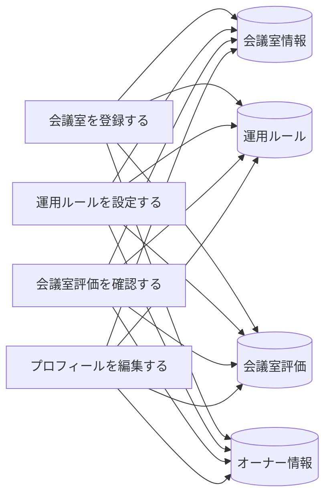

# 会議室登録フロー - BUC 俯瞰仕様

## 所属 UC 一覧

| # | UC名 | アクティビティ | 概要 |
|---|------|-------------|------|
| 1 | [会議室を登録する](会議室を登録する/spec.md) | 会議室を登録する | 会議室を登録する |
| 2 | [運用ルールを設定する](運用ルールを設定する/spec.md) | 運用ルールを設定する | 運用ルールを設定する |
| 3 | [会議室評価を確認する](会議室評価を確認する/spec.md) | 会議室評価を確認する | 会議室評価を確認する |
| 4 | [プロフィールを編集する](プロフィールを編集する/spec.md) | プロフィールを編集する | プロフィールを編集する |

## UC 横断データフロー

### 情報 CRUD マトリクス

| 情報 | 会議室を登録する | 運用ルールを設定する | 会議室評価を確認する | プロフィールを編集する |
|------|---|---|---|---|
| 会議室情報 | C | CU | R | CU |
| 運用ルール | C | CU | R | CU |
| 会議室評価 | C | CU | R | CU |
| オーナー情報 | C | CU | R | CU |

## 状態遷移全体図

状態遷移なし

### 状態遷移 UC マッピング

| - | - |

## BUC 内共有条件一覧

| 条件名 | 適用 UC |
|--------|--------|
| - | - |

## BUC 内共有バリエーション一覧

| バリエーション名 | 適用 UC |
|----------------|--------|
| - | - |
