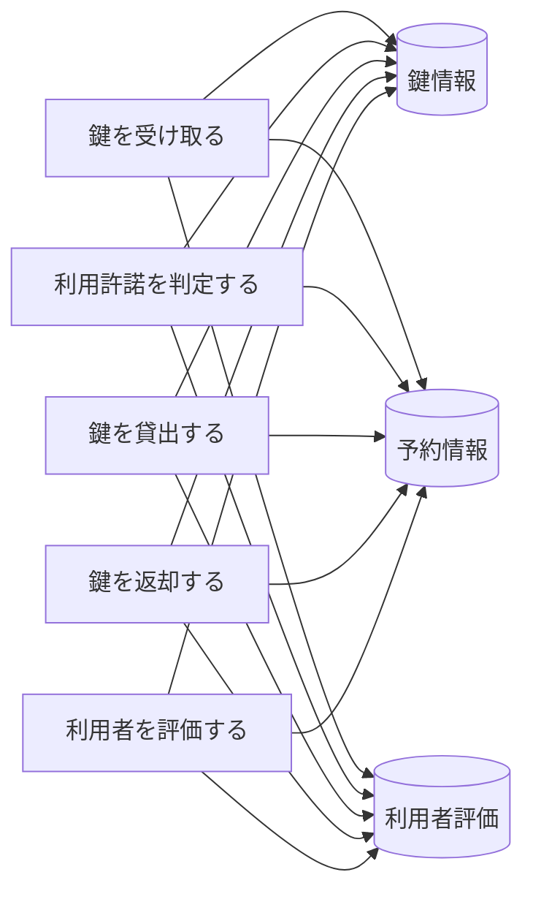
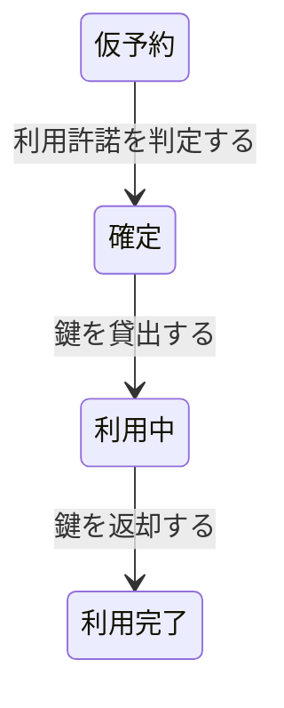

# 会議室貸出フロー - BUC 俯瞰仕様

## 所属 UC 一覧

| # | UC名 | アクティビティ | 概要 |
|---|------|-------------|------|
| 1 | [鍵を受け取る](鍵を受け取る/spec.md) | 鍵を受け取る | 鍵を受け取る |
| 2 | [利用許諾を判定する](利用許諾を判定する/spec.md) | 利用許諾を判定する | 利用許諾を判定する |
| 3 | [鍵を貸出する](鍵を貸出する/spec.md) | 鍵を貸出する | 鍵を貸出する |
| 4 | [鍵を返却する](鍵を返却する/spec.md) | 鍵を返却する | 鍵を返却する |
| 5 | [利用者を評価する](利用者を評価する/spec.md) | 利用者を評価する | 利用者を評価する |

## UC 横断データフロー

### 情報 CRUD マトリクス

| 情報 | 鍵を受け取る | 利用許諾を判定する | 鍵を貸出する | 鍵を返却する | 利用者を評価する |
|------|---|---|---|---|---|
| 鍵情報 | RU | RU | RU | RU | C |
| 予約情報 | RU | RU | RU | RU | C |
| 利用者評価 | RU | RU | RU | RU | C |

## 状態遷移全体図

### 状態遷移 UC マッピング

| 遷移 | 担当UC |
|------|-------|
| 仮予約 -> 確定 | 利用許諾を判定する |
| 確定 -> 利用中 | 鍵を貸出する |
| 利用中 -> 利用完了 | 鍵を返却する |

## BUC 内共有条件一覧

| 条件名 | 適用 UC |
|--------|--------|
| 利用許諾条件 | 利用許諾を判定する |

## BUC 内共有バリエーション一覧

| バリエーション名 | 適用 UC |
|----------------|--------|
| 決済方法 | 会議室を予約する |
