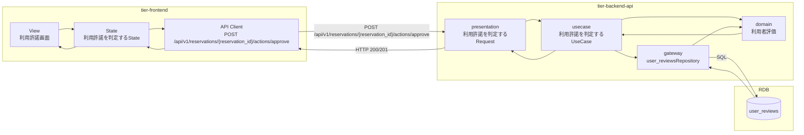
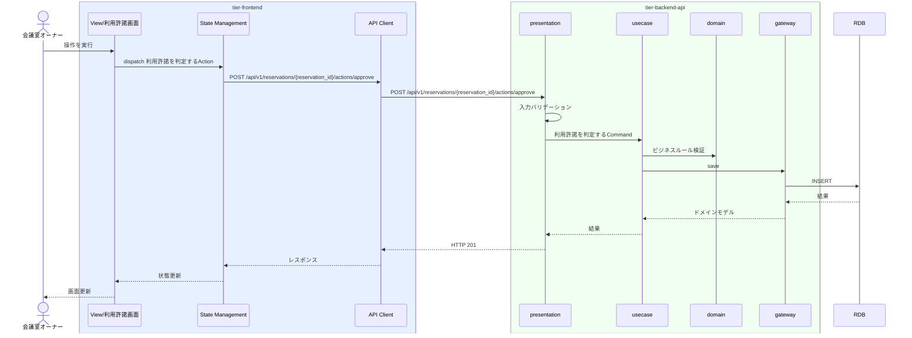

# 利用許諾を判定する

## 概要

利用者の過去評価を確認し使用許諾する

## データフロー



| レイヤー | データモデル | 変換内容 |
|---------|------------|---------|
| FE View | 利用許諾画面の入力/表示内容 | ユーザー操作をState/API呼び出しに変換 |
| BE presentation | 利用許諾を判定するRequest(利用者評価, 予約情報) | 入力バリデーション + UseCase呼び出し |
| BE gateway | user_reviews テーブル操作 | レコード作成 |
| Response | 操作結果 | 画面表示用データ |

## 処理フロー




## 分岐条件一覧

| 条件名 | 判定ルール | 適用 tier | 適用箇所 | BDD Scenario |
|--------|----------|----------|---------|-------------|
| 利用許諾条件 | RDRA条件定義に基づく | tier-backend-api | 利用許諾を判定するのビジネスルール | 利用許諾を判定する 利用許諾条件シナリオ |

## 状態遷移一覧

| 状態モデル | 遷移元 | 遷移先 | トリガー | 事前条件 | 事後処理 | 適用 tier |
|-----------|--------|--------|---------|---------|---------|----------|
| 予約状態 | 仮予約 | 確定 | 利用許諾を判定する | 仮予約であること | ステータス更新 | tier-backend-api |

## 関連 RDRA モデル

| モデル種別 | 要素名 | 関連 |
|-----------|--------|------|
| 業務 | 会議室貸出業務 | このUCが属する業務 |
| BUC | 会議室貸出フロー | このUCを含むBUC |
| アクター | 会議室オーナー | 操作するアクター |
| 情報 | 利用者評価 | 更新する情報 |
| 情報 | 予約情報 | 更新する情報 |
| 状態 | 予約状態 | 仮予約 -> 確定 |
| 条件 | 利用許諾条件 | 適用される条件 |


## E2E 完了条件（BDD）

### 正常系

```gherkin
Feature: 利用許諾を判定する

  Scenario: 利用許諾を判定するの正常実行
    Given 会議室オーナー「鈴木一郎」がログイン済みである
    When 利用許諾画面で操作を実行する
    Then 操作が正常に完了し画面にフィードバックが表示される
```

### 異常系

```gherkin
  Scenario: 認証エラー
    Given 未ログイン状態である
    When 利用許諾画面にアクセスする
    Then ログイン画面にリダイレクトされる

  Scenario: 利用許諾条件違反
    Given 会議室オーナー「鈴木一郎」がログイン済みである
    When 利用許諾条件を満たさない状態で操作を実行する
    Then エラーメッセージ「条件を満たしていません」が表示される

```

## ティア別仕様

- [フロントエンド](tier-frontend.md)
- [バックエンドAPI](tier-backend-api.md)

### 統合 API Spec

- [OpenAPI Spec](../../_cross-cutting/api/openapi.yaml)
