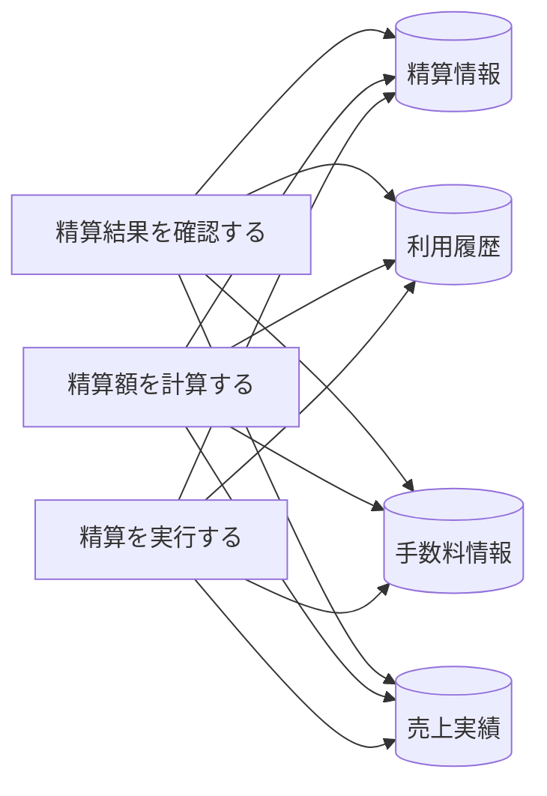

# オーナー精算フロー - BUC 俯瞰仕様

## 所属 UC 一覧

| # | UC名 | アクティビティ | 概要 |
|---|------|-------------|------|
| 1 | [精算結果を確認する](精算結果を確認する/spec.md) | 精算結果を確認する | 精算結果を確認する |
| 2 | [精算額を計算する](精算額を計算する/spec.md) | 精算額を計算する | 精算額を計算する |
| 3 | [精算を実行する](精算を実行する/spec.md) | 精算を実行する | 精算を実行する |

## UC 横断データフロー

### 情報 CRUD マトリクス

| 情報 | 精算結果を確認する | 精算額を計算する | 精算を実行する |
|------|---|---|---|
| 精算情報 | R | C | CU |
| 利用履歴 | R | C | CU |
| 手数料情報 | R | C | CU |
| 売上実績 | R | C | CU |

## 状態遷移全体図

状態遷移なし

### 状態遷移 UC マッピング

| - | - |

## BUC 内共有条件一覧

| 条件名 | 適用 UC |
|--------|--------|
| 精算条件 | 精算額を計算する |

## BUC 内共有バリエーション一覧

| バリエーション名 | 適用 UC |
|----------------|--------|
| - | - |
