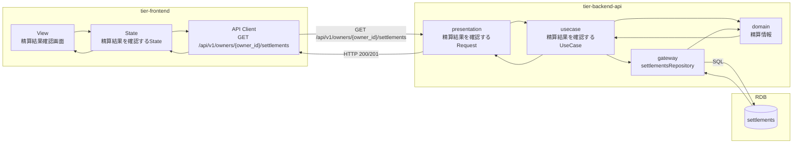
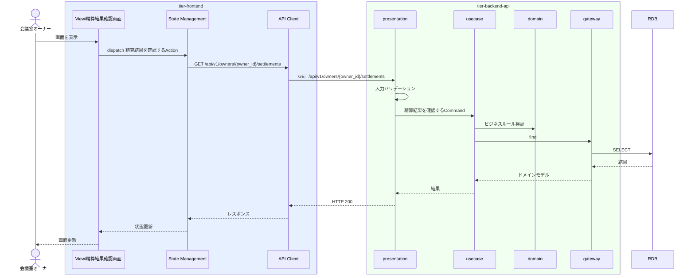

# 精算結果を確認する

## 概要

精算額と支払い状況を確認する

## データフロー



| レイヤー | データモデル | 変換内容 |
|---------|------------|---------|
| FE View | 精算結果確認画面の入力/表示内容 | ユーザー操作をState/API呼び出しに変換 |
| BE presentation | 精算結果を確認するRequest(精算情報, 売上実績) | 入力バリデーション + UseCase呼び出し |
| BE gateway | settlements テーブル操作 | レコード取得 |
| Response | 一覧/詳細データ | 画面表示用データ |

## 処理フロー




## 状態遷移一覧

| 状態モデル | 遷移元 | 遷移先 | トリガー | 事前条件 | 事後処理 | 適用 tier |
|-----------|--------|--------|---------|---------|---------|----------|
| - | - | - | - | - | - | - |

## 関連 RDRA モデル

| モデル種別 | 要素名 | 関連 |
|-----------|--------|------|
| 業務 | 精算業務 | このUCが属する業務 |
| BUC | オーナー精算フロー | このUCを含むBUC |
| アクター | 会議室オーナー | 操作するアクター |
| 情報 | 精算情報 | 参照する情報 |
| 情報 | 売上実績 | 参照する情報 |


## E2E 完了条件（BDD）

### 正常系

```gherkin
Feature: 精算結果を確認する

  Scenario: 精算結果を確認するの正常実行
    Given 会議室オーナー「鈴木一郎」がログイン済みである
    When 精算結果確認画面でデータを表示する
    Then データが正常に表示される
```

### 異常系

```gherkin
  Scenario: 認証エラー
    Given 未ログイン状態である
    When 精算結果確認画面にアクセスする
    Then ログイン画面にリダイレクトされる

```

## ティア別仕様

- [フロントエンド](tier-frontend.md)
- [バックエンドAPI](tier-backend-api.md)

### 統合 API Spec

- [OpenAPI Spec](../../_cross-cutting/api/openapi.yaml)
