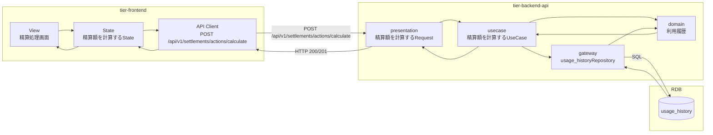
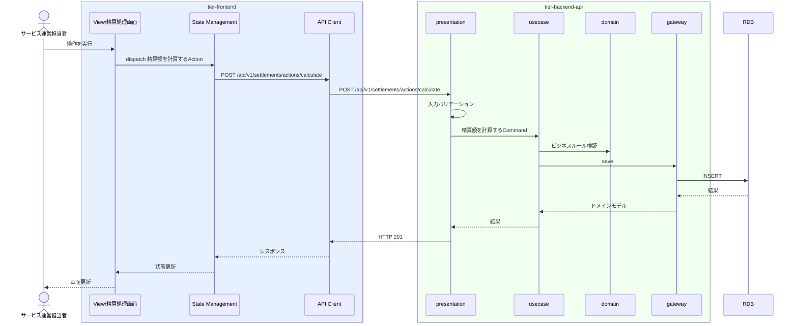

# 精算額を計算する

## 概要

会議室別の利用履歴から精算額を算出する

## データフロー



| レイヤー | データモデル | 変換内容 |
|---------|------------|---------|
| FE View | 精算処理画面の入力/表示内容 | ユーザー操作をState/API呼び出しに変換 |
| BE presentation | 精算額を計算するRequest(利用履歴, 手数料情報, 精算情報) | 入力バリデーション + UseCase呼び出し |
| BE gateway | usage_history テーブル操作 | レコード作成 |
| Response | 操作結果 | 画面表示用データ |

## 処理フロー




## 分岐条件一覧

| 条件名 | 判定ルール | 適用 tier | 適用箇所 | BDD Scenario |
|--------|----------|----------|---------|-------------|
| 精算条件 | RDRA条件定義に基づく | tier-backend-api | 精算額を計算するのビジネスルール | 精算額を計算する 精算条件シナリオ |

## 状態遷移一覧

| 状態モデル | 遷移元 | 遷移先 | トリガー | 事前条件 | 事後処理 | 適用 tier |
|-----------|--------|--------|---------|---------|---------|----------|
| - | - | - | - | - | - | - |

## 関連 RDRA モデル

| モデル種別 | 要素名 | 関連 |
|-----------|--------|------|
| 業務 | 精算業務 | このUCが属する業務 |
| BUC | オーナー精算フロー | このUCを含むBUC |
| アクター | サービス運営担当者 | 操作するアクター |
| 情報 | 利用履歴 | 更新する情報 |
| 情報 | 手数料情報 | 更新する情報 |
| 情報 | 精算情報 | 更新する情報 |

| 条件 | 精算条件 | 適用される条件 |


## E2E 完了条件（BDD）

### 正常系

```gherkin
Feature: 精算額を計算する

  Scenario: 精算額を計算するの正常実行
    Given サービス運営担当者「山田花子」がログイン済みである
    When 精算処理画面で操作を実行する
    Then 操作が正常に完了し画面にフィードバックが表示される
```

### 異常系

```gherkin
  Scenario: 認証エラー
    Given 未ログイン状態である
    When 精算処理画面にアクセスする
    Then ログイン画面にリダイレクトされる

  Scenario: 精算条件違反
    Given サービス運営担当者「山田花子」がログイン済みである
    When 精算条件を満たさない状態で操作を実行する
    Then エラーメッセージ「条件を満たしていません」が表示される

```

## ティア別仕様

- [フロントエンド](tier-frontend.md)
- [バックエンドAPI](tier-backend-api.md)
- [バックエンドワーカー](tier-backend-worker.md)

### 統合 API Spec

- [OpenAPI Spec](../../_cross-cutting/api/openapi.yaml)
