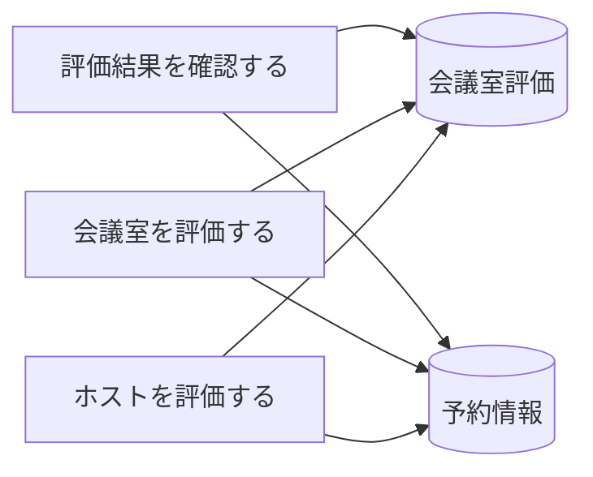

# 評価登録フロー - BUC 俯瞰仕様

## 所属 UC 一覧

| # | UC名 | アクティビティ | 概要 |
|---|------|-------------|------|
| 1 | [評価結果を確認する](評価結果を確認する/spec.md) | 評価結果を確認する | 評価結果を確認する |
| 2 | [会議室を評価する](会議室を評価する/spec.md) | 会議室を評価する | 会議室を評価する |
| 3 | [ホストを評価する](ホストを評価する/spec.md) | ホストを評価する | ホストを評価する |

## UC 横断データフロー

### 情報 CRUD マトリクス

| 情報 | 評価結果を確認する | 会議室を評価する | ホストを評価する |
|------|---|---|---|
| 会議室評価 | R | C | C |
| 予約情報 | R | C | C |

## 状態遷移全体図

状態遷移なし

### 状態遷移 UC マッピング

| - | - |

## BUC 内共有条件一覧

| 条件名 | 適用 UC |
|--------|--------|
| - | - |

## BUC 内共有バリエーション一覧

| バリエーション名 | 適用 UC |
|----------------|--------|
| 決済方法 | 会議室を予約する |
