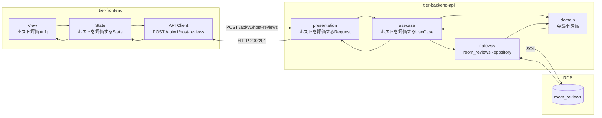
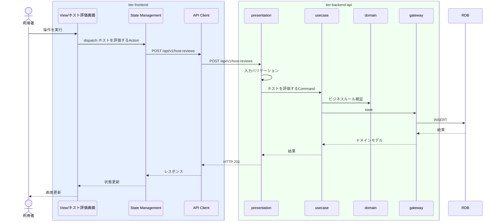

# ホストを評価する

## 概要

利用した会議室のホストを評価する

## データフロー



| レイヤー | データモデル | 変換内容 |
|---------|------------|---------|
| FE View | ホスト評価画面の入力/表示内容 | ユーザー操作をState/API呼び出しに変換 |
| BE presentation | ホストを評価するRequest(会議室評価, 予約情報) | 入力バリデーション + UseCase呼び出し |
| BE gateway | room_reviews テーブル操作 | レコード作成 |
| Response | 操作結果 | 画面表示用データ |

## 処理フロー



## バリエーション一覧

| バリエーション名 | 値 | 処理内容 | 適用 tier | 適用箇所 |
|----------------|---|---------|----------|---------|
| 評価種別 | (バリエーション.tsvの値) | 表示切替/フィルター | tier-frontend | ホスト評価画面 |


## 状態遷移一覧

| 状態モデル | 遷移元 | 遷移先 | トリガー | 事前条件 | 事後処理 | 適用 tier |
|-----------|--------|--------|---------|---------|---------|----------|
| - | - | - | - | - | - | - |

## 関連 RDRA モデル

| モデル種別 | 要素名 | 関連 |
|-----------|--------|------|
| 業務 | 評価業務 | このUCが属する業務 |
| BUC | 評価登録フロー | このUCを含むBUC |
| アクター | 利用者 | 操作するアクター |
| 情報 | 会議室評価 | 更新する情報 |
| 情報 | 予約情報 | 更新する情報 |


## E2E 完了条件（BDD）

### 正常系

```gherkin
Feature: ホストを評価する

  Scenario: ホストを評価するの正常実行
    Given 利用者「田中太郎」がログイン済みである
    When ホスト評価画面で操作を実行する
    Then 操作が正常に完了し画面にフィードバックが表示される
```

### 異常系

```gherkin
  Scenario: 認証エラー
    Given 未ログイン状態である
    When ホスト評価画面にアクセスする
    Then ログイン画面にリダイレクトされる

```

## ティア別仕様

- [フロントエンド](tier-frontend.md)
- [バックエンドAPI](tier-backend-api.md)

### 統合 API Spec

- [OpenAPI Spec](../../_cross-cutting/api/openapi.yaml)
