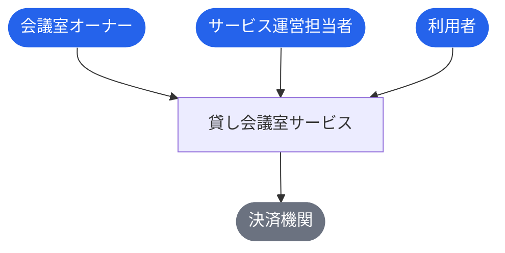
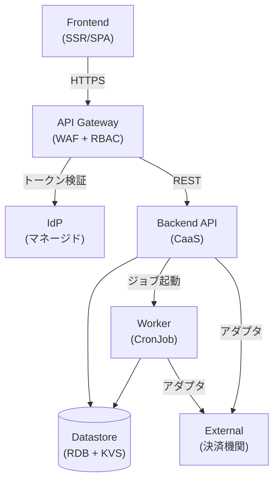
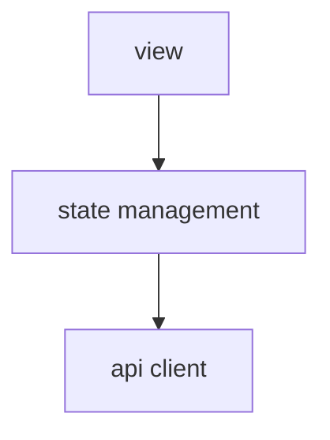
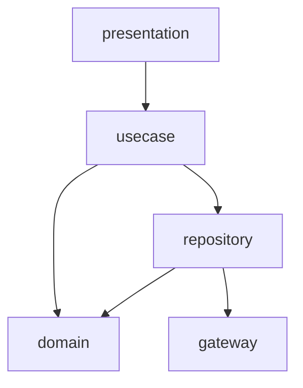
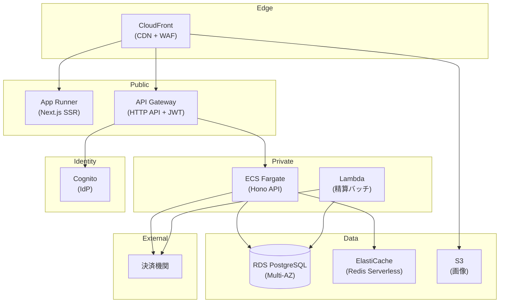

# 貸し会議室サービス

> 会議室オーナーが物件情報を登録し利用者に貸し出す、会議室シェアリングサービス。オーナーは会議室の登録・運用ルール設定・鍵管理・評価確認を行い、利用者は会議室の検索・予約・決済・評価を行う。サービス運営担当者がオーナー審査・手数料管理・利用状況分析・精算処理を担い、決済機関と連携してオーナーへの月末精算を実施する。

**最終更新**: 2026-04-01 04:14:08 logging policy enhancement (arch)

## 成果物一覧

| ドメイン | 最新 | イベント数 |
|---------|------|-----------:|
| [USDM（要求分解）](#usdm要求分解) | [usdm/latest/](usdm/latest/) | 1 |
| [RDRA（要件定義）](#rdra要件定義) | [rdra/latest/](rdra/latest/) | 1 |
| [NFR（非機能要求）](#nfr非機能要求) | [nfr/latest/](nfr/latest/) | 1 |
| [Arch（アーキテクチャ）](#archアーキテクチャ) | [arch/latest/](arch/latest/) | 2 |
| [Infra（インフラ設計）](#infraインフラ設計) | [infra/events/20260330_183227_infra_product_design/](infra/events/20260330_183227_infra_product_design/) | 1 |
| [Design（デザイン）](#designデザイン) | [design/latest/](design/latest/) | 2 |
| [Specs（詳細仕様）](#specs詳細仕様) | [specs/latest/](specs/latest/) | 1 |

## USDM（要求分解）

### 主要な成果物

- [requirements.md](usdm/latest/requirements.md)
- [requirements.yaml](usdm/latest/requirements.yaml)

| 項目 | 値 |
|------|-----|
| 要求数 | 10 |
| 仕様数 | 30 |

## RDRA（要件定義）

### 主要な成果物

- [アクター.tsv](rdra/latest/アクター.tsv)
- [外部システム.tsv](rdra/latest/外部システム.tsv)
- [情報.tsv](rdra/latest/情報.tsv)
- [状態.tsv](rdra/latest/状態.tsv)
- [条件.tsv](rdra/latest/条件.tsv)
- [バリエーション.tsv](rdra/latest/バリエーション.tsv)
- [BUC.tsv](rdra/latest/BUC.tsv)
- [関連データ.txt](rdra/latest/関連データ.txt)
- [ZeroOne.txt](rdra/latest/ZeroOne.txt)
- [システム概要.json](rdra/latest/システム概要.json)

| 項目 | 値 |
|------|-----|
| アクター | 3 |
| 外部システム | 1 |
| 情報 | 14 |
| 状態モデル | 3 |
| 条件 | 4 |
| バリエーション | 4 |
| 業務 | 7 |
| BUC | 11 |
| UC | 33 |

### 外部ツール連携

| ツール | データファイル | 手順 |
|--------|-------------|------|
| [RDRA Graph](https://vsa.co.jp/rdratool/graph/v0.94/) | [関連データ.txt](rdra/latest/関連データ.txt) | ファイル内容をコピーし、RDRA Graph に貼り付け |
| [RDRA Sheet](https://docs.google.com/spreadsheets/d/1h7J70l6DyXcuG0FKYqIpXXfdvsaqjdVFwc6jQXSh9fM/) | [ZeroOne.txt](rdra/latest/ZeroOne.txt) | ファイル内容をコピーし、テンプレートに貼り付け |

### システムコンテキスト図



## NFR（非機能要求）

### 主要な成果物

- [nfr-grade.md](nfr/latest/nfr-grade.md)
- [nfr-grade.yaml](nfr/latest/nfr-grade.yaml)

| 項目 | 値 |
|------|-----|
| モデルシステム | model2 |
| カテゴリ | 6 |
| 重要項目 | 78 |

## Arch（アーキテクチャ）

### 主要な成果物

- [arch-design.md](arch/latest/arch-design.md)
- [arch-design.yaml](arch/latest/arch-design.yaml)
- [coverage-report.md](arch/latest/coverage-report.md)

| 項目 | 値 |
|------|-----|
| 言語 | TypeScript |
| ティア | 7 |
| ポリシー | 22 |
| ルール | 9 |
| エンティティ | 15 |

### コンテナ図（システム構成）



### コンポーネント図（レイヤー依存）

**tier-frontend**



**tier-backend-api**



**tier-backend-worker**


## Infra（インフラ設計）

### 主要な成果物

- [最新イベント: 20260330_183227_infra_product_design](infra/events/20260330_183227_infra_product_design)
  - [product-cost-hints.yaml](infra/events/20260330_183227_infra_product_design/specs/product/output/product-cost-hints.yaml)
  - [product-impl-aws.yaml](infra/events/20260330_183227_infra_product_design/specs/product/output/product-impl-aws.yaml)
  - [product-mapping-aws.yaml](infra/events/20260330_183227_infra_product_design/specs/product/output/product-mapping-aws.yaml)
  - [product-observability.yaml](infra/events/20260330_183227_infra_product_design/specs/product/output/product-observability.yaml)
  - [product-workload-model.yaml](infra/events/20260330_183227_infra_product_design/specs/product/output/product-workload-model.yaml)
  - [main.tf](infra/events/20260330_183227_infra_product_design/infra/product/aws/main.tf)

### ワークロード全体構成図

> 出典: [architecture.md](infra/events/20260330_183227_infra_product_design/docs/cloud-context/generated-md/product/architecture.md)



## Design（デザイン）

### 主要な成果物

- [design-event.md](design/latest/design-event.md)
- [design-event.yaml](design/latest/design-event.yaml)
- [assets/](design/latest/assets) (SVG 21 ファイル)

### ブランド

| 項目 | 値 |
|------|-----|
| 名称 | RoomConnect |
| プライマリカラー | `#2563EB` |
| セカンダリカラー | `#0D9488` |
| トーン | 信頼性と親しみやすさを両立した丁寧な口調 |

### ポータル一覧

| ポータル | アクター | カラー |
|---------|---------|--------|
| 利用者ポータル | 利用者 | `#2563EB` |
| オーナーポータル | 会議室オーナー | `#0D9488` |
| 管理者ポータル | サービス運営担当者 | `#475569` |

### Storybook

```bash
cd docs/design/latest/storybook-app && npm run storybook
```

Stories: 42 ファイル

## Specs（詳細仕様）

### 主要な成果物

- [spec-event.md](specs/latest/spec-event.md)
- [spec-event.yaml](specs/latest/spec-event.yaml)

| 項目 | 値 |
|------|-----|
| UC | 33 |
| API | 33 |
| 非同期イベント | 1 |

### 横断設計

| 仕様 | ファイル |
|------|---------|
| UX デザイン仕様 | [ux-ui/ux-design.md](specs/latest/_cross-cutting/ux-ui/ux-design.md) |
| UI デザイン仕様 | [ux-ui/ui-design.md](specs/latest/_cross-cutting/ux-ui/ui-design.md) |
| データ可視化仕様 | [ux-ui/data-visualization.md](specs/latest/_cross-cutting/ux-ui/data-visualization.md) |
| 共通コンポーネント設計 | [ux-ui/common-components.md](specs/latest/_cross-cutting/ux-ui/common-components.md) |
| OpenAPI 3.1 | [api/openapi.yaml](specs/latest/_cross-cutting/api/openapi.yaml) |
| AsyncAPI 3.0 | [api/asyncapi.yaml](specs/latest/_cross-cutting/api/asyncapi.yaml) |
| RDB スキーマ | [datastore/rdb-schema.yaml](specs/latest/_cross-cutting/datastore/rdb-schema.yaml) |
| KVS スキーマ | [datastore/kvs-schema.yaml](specs/latest/_cross-cutting/datastore/kvs-schema.yaml) |
| トレーサビリティマトリクス | [traceability-matrix.md](specs/latest/_cross-cutting/traceability-matrix.md) |

### オーナー管理業務

**オーナー登録フロー**

- [規約を参照する](specs/latest/オーナー管理業務/オーナー登録フロー/規約を参照する/spec.md)
- [オーナーを登録する](specs/latest/オーナー管理業務/オーナー登録フロー/オーナーを登録する/spec.md)
- [オーナー申請する](specs/latest/オーナー管理業務/オーナー登録フロー/オーナー申請する/spec.md)
- [オーナー登録を審査する](specs/latest/オーナー管理業務/オーナー登録フロー/オーナー登録を審査する/spec.md)

**オーナー退会フロー**

- [オーナー退会する](specs/latest/オーナー管理業務/オーナー退会フロー/オーナー退会する/spec.md)
- [退会を処理する](specs/latest/オーナー管理業務/オーナー退会フロー/退会を処理する/spec.md)

### 会議室管理業務

**会議室登録フロー**

- [会議室を登録する](specs/latest/会議室管理業務/会議室登録フロー/会議室を登録する/spec.md)
- [運用ルールを設定する](specs/latest/会議室管理業務/会議室登録フロー/運用ルールを設定する/spec.md)
- [会議室評価を確認する](specs/latest/会議室管理業務/会議室登録フロー/会議室評価を確認する/spec.md)
- [プロフィールを編集する](specs/latest/会議室管理業務/会議室登録フロー/プロフィールを編集する/spec.md)

### 予約業務

**会議室予約フロー**

- [会議室を照会する](specs/latest/予約業務/会議室予約フロー/会議室を照会する/spec.md)
- [会議室を予約する](specs/latest/予約業務/会議室予約フロー/会議室を予約する/spec.md)
- [予約を変更する](specs/latest/予約業務/会議室予約フロー/予約を変更する/spec.md)
- [予約を取消する](specs/latest/予約業務/会議室予約フロー/予約を取消する/spec.md)

### 会議室貸出業務

**会議室貸出フロー**

- [鍵を受け取る](specs/latest/会議室貸出業務/会議室貸出フロー/鍵を受け取る/spec.md)
- [利用許諾を判定する](specs/latest/会議室貸出業務/会議室貸出フロー/利用許諾を判定する/spec.md)
- [鍵を貸出する](specs/latest/会議室貸出業務/会議室貸出フロー/鍵を貸出する/spec.md)
- [鍵を返却する](specs/latest/会議室貸出業務/会議室貸出フロー/鍵を返却する/spec.md)
- [利用者を評価する](specs/latest/会議室貸出業務/会議室貸出フロー/利用者を評価する/spec.md)

**問合せ対応フロー**

- [オーナーに問合せる](specs/latest/会議室貸出業務/問合せ対応フロー/オーナーに問合せる/spec.md)
- [問合せに回答する](specs/latest/会議室貸出業務/問合せ対応フロー/問合せに回答する/spec.md)

### 評価業務

**評価登録フロー**

- [評価結果を確認する](specs/latest/評価業務/評価登録フロー/評価結果を確認する/spec.md)
- [会議室を評価する](specs/latest/評価業務/評価登録フロー/会議室を評価する/spec.md)
- [ホストを評価する](specs/latest/評価業務/評価登録フロー/ホストを評価する/spec.md)

### サービス運営業務

**サービス運営管理フロー**

- [手数料売上を分析する](specs/latest/サービス運営業務/サービス運営管理フロー/手数料売上を分析する/spec.md)
- [運用状況を管理する](specs/latest/サービス運営業務/サービス運営管理フロー/運用状況を管理する/spec.md)

**利用状況管理フロー**

- [利用履歴を管理する](specs/latest/サービス運営業務/利用状況管理フロー/利用履歴を管理する/spec.md)
- [利用状況を分析する](specs/latest/サービス運営業務/利用状況管理フロー/利用状況を分析する/spec.md)

**サービス問合せ対応フロー**

- [サービスに問合せる](specs/latest/サービス運営業務/サービス問合せ対応フロー/サービスに問合せる/spec.md)
- [サービス問合せに回答する](specs/latest/サービス運営業務/サービス問合せ対応フロー/サービス問合せに回答する/spec.md)

### 精算業務

**オーナー精算フロー**

- [精算結果を確認する](specs/latest/精算業務/オーナー精算フロー/精算結果を確認する/spec.md)
- [精算額を計算する](specs/latest/精算業務/オーナー精算フロー/精算額を計算する/spec.md)
- [精算を実行する](specs/latest/精算業務/オーナー精算フロー/精算を実行する/spec.md)

> 7 業務 / 11 BUC / 33 UC

## ADRs（設計判断記録）

| # | ドメイン | 判断 | ステータス |
|---|---------|------|----------|
| 1 | Arch | [テクノロジースタック選定: TypeScript + Next.js + Hono](arch/events/20260330_182346_initial_arch/decisions/arch-decision-001.yaml) | approved |
| 2 | Arch | [データモデル戦略: event_snapshot パターン優先](arch/events/20260330_182346_initial_arch/decisions/arch-decision-002.yaml) | approved |
| 3 | Arch | [エラーハンドリング伝播方針](arch/events/20260401_041408_logging_policy_enhancement/decisions/arch-decision-003.yaml) | approved |
| 4 | Arch | [ログ観測性方針](arch/events/20260401_041408_logging_policy_enhancement/decisions/arch-decision-004.yaml) | approved |
| 5 | Infra | [コンピュートプラットフォーム選定: ECS Fargate](infra/events/20260330_183227_infra_product_design/docs/cloud-context/decisions/product/product-decision-001.yaml) | approved |
| 6 | Infra | [データベース選定: RDS for PostgreSQL (Multi-AZ)](infra/events/20260330_183227_infra_product_design/docs/cloud-context/decisions/product/product-decision-002.yaml) | approved |
| 7 | Infra | [バッチ処理方式: Lambda + EventBridge Scheduler](infra/events/20260330_183227_infra_product_design/docs/cloud-context/decisions/product/product-decision-003.yaml) | approved |
| 8 | Design | [ブランドアイデンティティ: 信頼性と使いやすさ重視のデザイン方向性](design/events/20260330_184257_design_system/decisions/design-decision-001.yaml) | approved |
| 9 | Specs | [API スタイル選定: REST + AsyncAPI イベント駆動](specs/events/20260330_185847_spec_generation/decisions/spec-decision-001.yaml) | approved |

## イベント履歴

| 日時 | ドメイン | イベントID |
|------|---------|-----------|
| 2026-03-30 18:06:53 | USDM（要求分解） | [20260330_180653_initial_build](usdm/events/20260330_180653_initial_build) |
| 2026-03-30 18:06:53 | RDRA（要件定義） | [20260330_180653_initial_build](rdra/events/20260330_180653_initial_build) |
| 2026-03-30 18:16:37 | NFR（非機能要求） | [20260330_181637_initial_nfr](nfr/events/20260330_181637_initial_nfr) |
| 2026-03-30 18:23:46 | Arch（アーキテクチャ） | [20260330_182346_initial_arch](arch/events/20260330_182346_initial_arch) |
| 2026-03-30 18:32:27 | Infra（インフラ設計） | [20260330_183227_infra_product_design](infra/events/20260330_183227_infra_product_design) |
| 2026-03-30 18:42:57 | Design（デザイン） | [20260330_184257_design_system](design/events/20260330_184257_design_system) |
| 2026-03-30 18:58:47 | Specs（詳細仕様） | [20260330_185847_spec_generation](specs/events/20260330_185847_spec_generation) |
| 2026-03-30 19:24:23 | Design（デザイン） | [20260330_192423_spec_stories](design/events/20260330_192423_spec_stories) |
| 2026-04-01 04:14:08 | Arch（アーキテクチャ） | [20260401_041408_logging_policy_enhancement](arch/events/20260401_041408_logging_policy_enhancement) |

---

*このファイルは `generateReadme.js` により自動生成されています。手動編集しないでください。*
