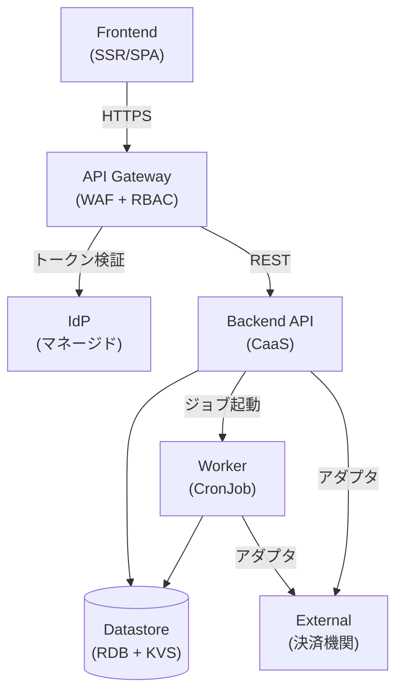
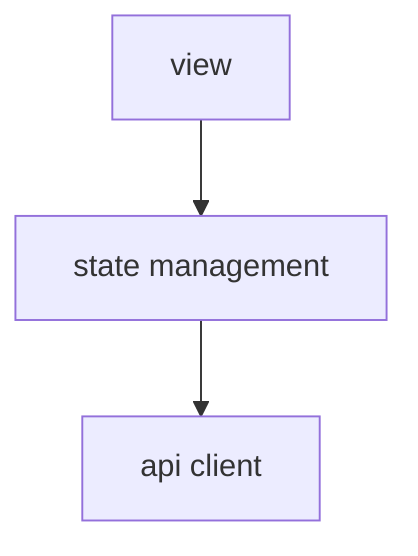
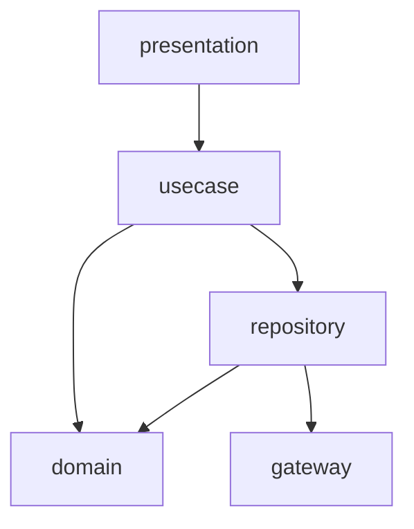
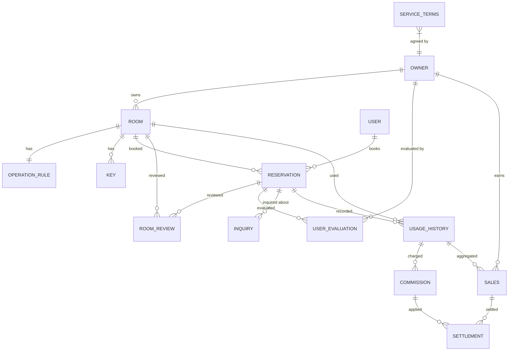

# アーキテクチャ設計書

## 概要

| 項目 | 内容 |
|------|------|
| イベントID | 20260330_182346_initial_arch |
| 作成日時 | 2026-03-30T18:23:46 |
| ソース | RDRA モデルと NFR グレードからの初期アーキテクチャ設計 |
| 言語 | TypeScript |
| フレームワーク | Next.js, Hono |
| 技術的制約 | モノレポ構成, ベンダーニュートラル（クラウドベンダー固有サービス不使用） |

## システムアーキテクチャ

### システム構成図

### ティア構成

| ID | ティア名 | 説明 | テクノロジー候補 |
|-----|---------|------|----------------|
| tier-frontend | フロントエンド | 利用者・オーナー・運営担当者向け Web UI。レスポンシブデザインでモバイル・デスクトップ両対応 | SSR, SPA |
| tier-api-gateway | API Gateway | フロントエンドからのリクエストを受け付け、認証トークン検証・粗粒度 RBAC・レート制限・WAF 統合を行う | API Gateway, リバースプロキシ |
| tier-idp | IdP | OAuth2/OIDC ベースの認証基盤。トークン発行・ユーザー登録・パスワードリセット・MFA 管理を担う | マネージド IdP |
| tier-backend-api | バックエンド API | ビジネスロジックを実行する API サーバー。7業務・約30UC のビジネスフローを処理する | CaaS(k8s) |
| tier-backend-worker | バックエンドワーカー | 精算バッチ処理を実行するワーカー。月末精算の定期実行を担う | CronJob(k8s), FaaS |
| tier-datastore | データストア | RDB をメインストレージ、KVS をキャッシュ・セッション用に使用する | RDB, KVS |
| tier-external | 外部連携 | 決済機関との連携を担うアダプタ層。冪等性と耐障害性を確保する | アダプタパターン |

### フロントエンド (tier-frontend) の方針・ルール

#### 方針

| ID | 方針名 | 内容 | 根拠 | RDRA/NFR 要素 | 確信度 |
|-----|---------|------|------|--------------|:------:|
| SP-001 | レスポンシブデザイン | モバイル・デスクトップ両対応のレスポンシブ UI を提供する | 利用者がスマートフォンから会議室検索・予約を行うため | BUC: 会議室予約フロー, NFR F.1.1.2, NFR F.1.1.3 | 高 |
| SP-002 | 主要ブラウザ全対応 | 主要ブラウザおよびモバイルブラウザに対応する | NFR F.1.1.2 対応ブラウザ(Lv3) への対応 | NFR F.1.1.2 | 高 |
| SP-003 | SSR によるパフォーマンス最適化 | 会議室検索画面等の主要画面は SSR で初回表示を高速化する | NFR B.2.1.1 レスポンスタイム(Lv3: 5秒以内) への対応。利用者向け会議室検索画面の初回表示を最適化 | BUC: 会議室予約フロー, NFR B.2.1.1 | 中 |

#### ルール

| ID | ルール名 | 内容 | 根拠 | RDRA/NFR 要素 | 確信度 |
|-----|---------|------|------|--------------|:------:|
| SR-001 | API 経由のデータアクセス | フロントエンドからデータストアへの直接アクセスを禁止し、必ず Backend API を経由する | セキュリティとデータ整合性の確保 | NFR E.5.2.1 | 高 |
| SR-002 | 冪等キー生成 | 状態変更リクエスト（予約・申請・精算等）ごとに冪等キー（UUID）を生成し、リクエストヘッダー X-Idempotency-Key に付与する。ダブルクリック防止の UI 制御も併用する | 外部ユーザーのリトライによる重複送信リスクの防止 | アクター: 利用者, 会議室オーナー, NFR E.5.1.1 | 高 |
| SR-003 | trace_id 生成 | リクエストごとに trace_id（UUID）を生成し、リクエストヘッダーに付与する。冪等キーと共に送信する | リクエストの起点を一意に特定するため | NFR C.1.3.1, NFR C.6.1.1 | 中 |

### API Gateway (tier-api-gateway) の方針・ルール

#### 方針

| ID | 方針名 | 内容 | 根拠 | RDRA/NFR 要素 | 確信度 |
|-----|---------|------|------|--------------|:------:|
| SP-004 | トークン検証の一元化 | IdP が発行した JWT/OAuth2 トークンを API Gateway で一元検証する | 外部アクター3種（利用者・オーナー・運営）が存在し、認証トークン検証を集約する必要があるため | アクター: 利用者, 会議室オーナー, サービス運営担当者, NFR E.5.1.1 | 高 |
| SP-005 | 粗粒度 RBAC | API エンドポイント単位で、ロール（利用者/オーナー/運営担当者）に基づくアクセス制御を実施する | NFR E.5.2.1 アクセス制御(Lv2: RBAC) への対応 | NFR E.5.2.1, アクター: 利用者, 会議室オーナー, サービス運営担当者 | 高 |
| SP-006 | WAF 統合 | API Gateway 前段で WAF を統合し、OWASP Top10 攻撃を防御する | NFR E.10.1.1 WAF(Lv2) への対応 | NFR E.10.1.1, NFR E.10.2.1 | 中 |
| SP-007 | IP アドレス制限（管理画面） | サービス運営担当者向け管理画面 API へのアクセスを IP アドレスで制限する | NFR E.5.3.1 利用制限(Lv2: 管理画面 IP 制限) への対応 | NFR E.5.3.1, アクター: サービス運営担当者 | 低 |

#### ルール

| ID | ルール名 | 内容 | 根拠 | RDRA/NFR 要素 | 確信度 |
|-----|---------|------|------|--------------|:------:|
| SR-004 | レート制限 | ティアごとの API レート制限を設定し、過負荷を防止する | 外部ユーザーからの大量リクエストに対する保護 | アクター: 利用者, NFR B.1.1.1 | 中 |

### IdP (tier-idp) の方針・ルール

#### 方針

| ID | 方針名 | 内容 | 根拠 | RDRA/NFR 要素 | 確信度 |
|-----|---------|------|------|--------------|:------:|
| SP-008 | OAuth2/OIDC 認証 | 外部アクター（利用者・オーナー）および内部アクター（運営担当者）の認証を OAuth2/OIDC プロトコルで実施する | 外部アクターが利用するため、標準的な認証プロトコルが必要 | アクター: 利用者, 会議室オーナー, サービス運営担当者, NFR E.5.1.1 | 高 |
| SP-009 | パスワードポリシー | パスワード複雑性・有効期限ポリシーを適用する | NFR E.5.1.1 認証方式(Lv2: パスワードポリシー) への対応 | NFR E.5.1.1 | 高 |
| SP-010 | 不正ログイン検知 | 不正ログイン試行を検知し通知する | NFR E.7.2.1 不正監視(Lv2: 不正ログイン検知+通知) への対応 | NFR E.7.2.1 | 中 |

### バックエンド API (tier-backend-api) の方針・ルール

#### 方針

| ID | 方針名 | 内容 | 根拠 | RDRA/NFR 要素 | 確信度 |
|-----|---------|------|------|--------------|:------:|
| SP-011 | スケールアウト対応 | 負荷に応じてインスタンスを水平スケーリングする。通常時~100,000件/日、ピーク時は通常の2倍のリクエストに対応し、~100 TPS のスループットを確保する | NFR B.1.1.1 同時アクセス数(Lv3: ~10,000)、NFR B.1.1.3 オンラインリクエスト件数(Lv3: ~100,000件/日)、NFR B.1.2.1 ピーク時(Lv2: 通常2倍)、NFR B.2.1.2 スループット(Lv3: ~100 TPS)、NFR B.3.1.1 CPU拡張性(Lv2: スケールアウト) への対応 | NFR B.1.1.1, NFR B.1.1.3, NFR B.1.2.1, NFR B.2.1.2, NFR B.3.1.1 | 中 |
| SP-012 | ヘルスチェック | Readiness/Liveness プローブを実装し、CaaS(k8s) のヘルスチェックに対応する | NFR A.1.1.1 運用時間(Lv3) に対応するため、異常インスタンスの自動排除が必要 | NFR A.1.1.1, NFR A.2.1.1 | 中 |
| SP-013 | 冪等性確保（API 層） | 冪等キーを KVS で管理し、重複リクエストを検知して前回レスポンスを返却する。状態変更を伴う操作（POST/PUT/DELETE）が対象 | 予約・精算等の金銭取引を伴う状態変更操作での重複処理防止 | 状態: 予約状態, 外部システム: 決済機関, 情報: 精算情報 | 高 |

#### ルール

| ID | ルール名 | 内容 | 根拠 | RDRA/NFR 要素 | 確信度 |
|-----|---------|------|------|--------------|:------:|
| SR-005 | API バージョニング | URL パスにバージョン番号を含める（/v1/...）方式で API バージョニングを行う | 一般的なベストプラクティスとして適用 | なし | デフォルト |

### バックエンドワーカー (tier-backend-worker) の方針・ルール

#### 方針

| ID | 方針名 | 内容 | 根拠 | RDRA/NFR 要素 | 確信度 |
|-----|---------|------|------|--------------|:------:|
| SP-014 | バッチ処理時間制限 | 精算バッチは8時間以内に完了すること | NFR B.2.2.1 バッチ処理時間(Lv2: 8時間以内) への対応 | BUC: オーナー精算フロー, NFR B.2.2.1 | 中 |
| SP-015 | 冪等性確保（ワーカー） | ジョブ実行 ID で重複実行を検知する | 精算バッチの重複実行による二重支払い防止 | BUC: オーナー精算フロー, 情報: 精算情報, 外部システム: 決済機関 | 高 |

#### ルール

| ID | ルール名 | 内容 | 根拠 | RDRA/NFR 要素 | 確信度 |
|-----|---------|------|------|--------------|:------:|
| SR-006 | ジョブ実行ログ | バッチジョブの開始・終了・処理件数・エラー件数を構造化ログで記録する | NFR C.6.1.2 ログ種別(Lv3: 操作ログ+監査ログ) への対応 | NFR C.6.1.1, NFR C.6.1.2 | 中 |

### データストア (tier-datastore) の方針・ルール

#### 方針

| ID | 方針名 | 内容 | 根拠 | RDRA/NFR 要素 | 確信度 |
|-----|---------|------|------|--------------|:------:|
| SP-016 | トランザクション整合性 | 予約・決済・精算に関するデータは RDB でトランザクション整合性を保証する | 情報「予約情報」「精算情報」「手数料情報」が金銭取引に関わるため | 情報: 予約情報, 精算情報, 手数料情報 | 高 |
| SP-017 | 日次バックアップ | フル+差分バックアップを日次で実施し、7世代を保持する | NFR C.1.2.1 バックアップ方式(Lv2) および NFR C.1.2.3 世代管理(Lv2: 7世代) への対応 | NFR C.1.2.1, NFR C.1.2.3 | 中 |
| SP-018 | 個人情報暗号化 | オーナー情報・利用者情報の個人情報（氏名・メールアドレス・電話番号）は保管時に暗号化する | NFR E.6.1.1 データ暗号化(Lv1: 機密データのみ) への対応 | NFR E.6.1.1, 情報: オーナー情報, 利用者情報 | 高 |
| SP-019 | ストレージ冗長化 | データストアのストレージを冗長化（RAID5 相当）する | NFR A.2.5.1 ストレージの冗長化(Lv2: RAID5) への対応 | NFR A.2.5.1 | 中 |
| SP-020 | RPO 数時間以内 | 障害時の目標復旧地点を数時間前までとする | NFR A.4.1.1 RPO(Lv2: 数時間前) への対応 | NFR A.4.1.1 | 中 |

#### ルール

| ID | ルール名 | 内容 | 根拠 | RDRA/NFR 要素 | 確信度 |
|-----|---------|------|------|--------------|:------:|
| SR-007 | 冪等キー UNIQUE 制約 | 冪等キーカラムに UNIQUE 制約を設定し、ON CONFLICT（UPSERT）で重複挿入を防止する | データ層での重複処理防止の最終防衛ライン | 情報: 予約情報, 精算情報 | 高 |
| SR-008 | テスト環境マスキング | テスト環境では個人情報をマスキングする | NFR E.6.2.1 データマスキング(Lv2) への対応 | NFR E.6.2.1 | 中 |

### 外部連携 (tier-external) の方針・ルール

#### 方針

| ID | 方針名 | 内容 | 根拠 | RDRA/NFR 要素 | 確信度 |
|-----|---------|------|------|--------------|:------:|
| SP-021 | 冪等性確保（外部連携） | 決済機関への精算リクエストの冪等性を確保し、二重支払いを防止する | 外部システム「決済機関」との精算処理で二重支払いリスクがあるため | 外部システム: 決済機関, BUC: オーナー精算フロー | 高 |
| SP-022 | Circuit Breaker | 決済機関との通信障害時に Circuit Breaker で連鎖障害を防止する | 外部システム「決済機関」との連携で障害の連鎖を防止するため | 外部システム: 決済機関, NFR A.1.2.1 | 中 |

#### ルール

| ID | ルール名 | 内容 | 根拠 | RDRA/NFR 要素 | 確信度 |
|-----|---------|------|------|--------------|:------:|
| SR-009 | リトライポリシー | 外部システム連携のリトライは指数バックオフで最大3回とする | 外部システムの一時的障害への耐性確保 | 外部システム: 決済機関, NFR A.1.2.1 | 中 |

### ティア共通の方針

| ID | 方針名 | 内容 | 根拠 | RDRA/NFR 要素 | 確信度 |
|-----|---------|------|------|--------------|:------:|
| CTP-001 | 認証方式 | OAuth2/OIDC ベースの認証を全ティア共通で採用する。IdP がトークン発行・管理を担い、API Gateway がトークン検証を一元化する | 外部アクター（利用者・オーナー）が利用するため、標準的な認証プロトコルが必要 | アクター: 利用者, 会議室オーナー, サービス運営担当者, NFR E.5.1.1 | 高 |
| CTP-002 | 認可方式 | RBAC + Backend 作り込み方式を採用する。API Gateway で粗粒度 RBAC（ロール: 利用者/オーナー/運営）、Backend API で細粒度の所有権・条件ベースのアクセス制御を if 文で作り込む | アクター3種のロールベース + オーナーの会議室所有権ベース + 利用者評価による条件ベースの認可パターンがあるが、いずれも少数のため Backend 作り込みで十分 | アクター: 利用者, 会議室オーナー, サービス運営担当者, 条件: オーナー審査条件, 利用許諾条件, NFR E.5.2.1 | 中 |
| CTP-003 | 構造化ログと相関ID | 全ティアで JSON 形式の構造化ログを出力する。trace_id, span_id, service, timestamp を必須フィールドとし、リクエストの全処理経路を追跡可能にする | NFR C.1.3.1 監視範囲(Lv3: アプリケーション監視) および NFR C.6.1.2 ログ種別(Lv3) への対応 | NFR C.1.3.1, NFR C.6.1.1, NFR C.6.1.2 | 中 |
| CTP-004 | IdP 方式 | マネージド IdP サービスを採用する。ユーザー登録・パスワードリセット・MFA 管理を IdP に委譲し、運用負荷を軽減する | 外部アクター2種 + 内部アクター1種の認証を効率的に管理するため | アクター: 利用者, 会議室オーナー, サービス運営担当者, NFR E.5.1.1 | 中 |
| CTP-005 | 冪等性方針 | 状態遷移を伴う操作・外部連携・金銭取引において冪等性を確保する。フロントエンドで冪等キー生成、Backend API で KVS による重複検知、RDB で UNIQUE 制約、ワーカーでジョブ ID による重複検知を行う | 予約状態の7状態遷移、決済機関との精算処理、外部ユーザーのリトライリスクが存在するため | 状態: 予約状態, 外部システム: 決済機関, アクター: 利用者, 会議室オーナー, 情報: 精算情報 | 高 |
| CTP-006 | ヘルスチェック | 全ティアに Readiness/Liveness ヘルスチェックエンドポイントを実装する | NFR A.1.1.1 運用時間(Lv3: 23時間運用) に対応するため、異常検知と自動復旧の基盤が必要 | NFR A.1.1.1, NFR A.2.1.1 | 中 |
| CTP-007 | 監査ログ | 全ティアで誰が、何を、いつ、どうしたかを記録する監査ログを出力する。ログ保管期間は1年 | NFR E.7.1.1 監査ログ(Lv2: データアクセスログ) および NFR C.6.1.1 ログ保管期間(Lv4: 1年) への対応 | NFR E.7.1.1, NFR C.6.1.1 | 中 |
| CTP-008 | 障害検知・通知 | 監視ツールによる障害検知とメール+チャット通知を全ティア共通で実施する。運用監視は1時間程度の停止を許容する24時間体制とする | NFR C.1.1.1 運用監視時間(Lv3: 1時間停止あり)、NFR C.3.1.1 障害検知方式(Lv2)、NFR C.3.2.1 障害通知方式(Lv2) への対応 | NFR C.1.1.1, NFR C.3.1.1, NFR C.3.2.1 | 中 |
| CTP-009 | 災害対策 | コールドスタンバイ拠点を用意し、24時間以内に業務継続可能な状態に復旧する | NFR A.3.1.1 災害対策の範囲(Lv2) および NFR A.3.1.2 業務継続の要否(Lv1) への対応 | NFR A.3.1.1, NFR A.3.1.2 | 中 |
| CTP-010 | RTO 2時間以内 | 障害時の目標復旧時間を2時間以内とする | NFR A.4.1.2 RTO(Lv3: 2時間以内) への対応 | NFR A.4.1.2 | 中 |
| CTP-011 | セキュリティポリシー準拠 | 組織のセキュリティポリシーに準拠し、個人情報保護法を遵守する | NFR E.1.1.1 セキュリティポリシー(Lv2) および NFR E.1.2.1 準拠法規(Lv2: 個人情報保護法) への対応 | NFR E.1.1.1, NFR E.1.2.1 | 高 |
| CTP-012 | セキュリティ診断 | 手動による脆弱性診断を定期的に実施する | NFR E.3.1.1 セキュリティ診断(Lv2) への対応 | NFR E.3.1.1 | デフォルト |
| CTP-013 | マルウェア対策 | 全サーバーにマルウェア対策を導入し、定義ファイル自動更新と定期スキャンを実施する | NFR E.9.1.1 マルウェア対策(Lv2) への対応 | NFR E.9.1.1 | デフォルト |
| CTP-014 | ネットワーク分離 | DMZ と内部セグメントを分離し、ファイアウォール（ステートフルインスペクション）で通信を制御する | NFR E.8.1.1 ファイアウォール(Lv2) および NFR E.8.3.1 ネットワーク分離(Lv2) への対応 | NFR E.8.1.1, NFR E.8.3.1 | デフォルト |
| CTP-015 | IDS/IPS | IPS をインライン構成で導入し、不正アクセスを検知・遮断する | NFR E.8.2.1 IDS/IPS(Lv2) への対応 | NFR E.8.2.1 | デフォルト |
| CTP-016 | セキュリティリスク分析 | 脅威・脆弱性評価を含むセキュリティリスク分析を実施する | NFR E.2.1.1 セキュリティリスク分析(Lv2) への対応 | NFR E.2.1.1 | デフォルト |
| CTP-017 | セキュリティリスク管理 | 四半期ごとに定期的なリスクレビューを実施する | NFR E.4.1.1 リスク管理プロセス(Lv2) への対応 | NFR E.4.1.1 | デフォルト |
| CTP-018 | インシデント対応 | インシデント対応手順書を整備し、定期訓練を実施する | NFR E.11.1.1 インシデント対応計画(Lv2) への対応 | NFR E.11.1.1 | デフォルト |
| CTP-019 | サービス切替 | コールドスタンバイ構成で60分未満のサービス切替を実現する | NFR A.1.2.1 サービス切替時間(Lv3: 60分未満) への対応 | NFR A.1.2.1 | 中 |
| CTP-020 | 性能テスト | ピーク時想定の負荷テストを実施する | NFR B.4.1.1 性能テスト(Lv3: 負荷テスト) への対応 | NFR B.4.1.1 | デフォルト |
| CTP-021 | サーバ冗長化 | N+1冗長構成（手動切替）を採用する | NFR A.2.1.1 サーバ内の冗長化(Lv3: N+1冗長) への対応 | NFR A.2.1.1 | デフォルト |
| CTP-022 | 計画停止対応 | 不定期の計画停止を許容し、事前通知3日前に実施する。計画保守は深夜帯（計画停止時間帯と同一）に行う | NFR A.1.1.3 計画停止の有無(Lv3) および NFR C.2.1.1 計画保守の時間帯(Lv2) への対応 | NFR A.1.1.3, NFR C.2.1.1 | デフォルト |
| CTP-023 | パッチ適用方針 | 定期的パッチ適用（四半期）を実施し、ライフサイクル管理（バージョン管理+EOL計画的対応）を行う | NFR C.2.1.2 パッチ適用方針(Lv2) および NFR C.2.2.1 ライフサイクル管理(Lv2) への対応 | NFR C.2.1.2, NFR C.2.2.1 | デフォルト |
| CTP-024 | サポート体制 | 24時間対応（平日）のサポート体制を整備し、2段階エスカレーション（担当→責任者）を行う | NFR C.5.1.1 サポート時間(Lv3) および NFR C.5.2.1 エスカレーション体制(Lv2) への対応 | NFR C.5.1.1, NFR C.5.2.1 | デフォルト |
| CTP-025 | テスト・開発環境 | 簡易テスト環境（本番縮小構成）とローカル+クラウド開発環境を整備する | NFR C.4.1.1 テスト環境(Lv2) および NFR C.4.2.1 開発環境(Lv2) への対応 | NFR C.4.1.1, NFR C.4.2.1 | デフォルト |
| CTP-026 | ネットワーク機器冗長化 | 一部ネットワーク機器の冗長化を実施する | NFR A.2.3.1 ネットワーク機器の冗長化(Lv2) への対応 | NFR A.2.3.1 | デフォルト |
| CTP-027 | 電源冗長化 | UPS（無停電電源装置）を導入する | NFR A.2.6.2 電源の冗長化(Lv2) への対応 | NFR A.2.6.2 | デフォルト |
| CTP-028 | 移行方式 | 段階移行（機能/部門単位で順次移行）方式を採用する。データ移行量は~100GB を想定する | NFR D.2.1.1 移行方式(Lv2) および NFR D.4.1.1 データ移行量(Lv1: ~100GB) への対応 | NFR D.2.1.1, NFR D.4.1.1 | デフォルト |
| CTP-029 | 移行リハーサル | 移行リハーサルを2回実施し、機能テスト合格+データ検証合格を移行判定基準とする。切り戻し手順書+判断基準を用意する | NFR D.5.1.1 移行リハーサル(Lv2), NFR D.5.1.2 移行判定基準(Lv2), NFR D.5.1.3 切り戻し計画(Lv2) への対応 | NFR D.5.1.1, NFR D.5.1.2, NFR D.5.1.3 | デフォルト |
| CTP-030 | トークンライフサイクル管理 | アクセストークン有効期限を短期（15分〜1時間）に設定し、リフレッシュトークンで更新する。リフレッシュトークンは長期（1日〜30日）とし、ローテーションを行う | IdP 導入に伴うセッションハイジャック防止 | NFR E.5.1.1, アクター: 利用者, 会議室オーナー | 中 |
| CTP-031 | OS・デバイス対応 | 主要2-3 OS（Windows, macOS, iOS/Android）およびPC+スマートフォンに対応する | NFR F.1.1.1 対応OS(Lv2) および NFR F.1.1.3 対応デバイス(Lv2) への対応 | NFR F.1.1.1, NFR F.1.1.3 | 中 |
| CTP-032 | トレーサビリティ ID 体系 | OpenTelemetry 標準 (trace_id + span_id) をティア単位で発行する。session_id, user_id, 業務エンティティ ID（予約ID・精算ID等）をログ context に含め、リクエスト横断・業務横断の追跡を可能にする | NFR C.1.3.1 監視範囲(Lv3: アプリケーション監視)、NFR C.6.1.2 ログ種別(Lv3) への対応。分散システムの横断トレーサビリティに OpenTelemetry 標準を採用 | NFR C.1.3.1, NFR C.6.1.1, NFR C.6.1.2 | 中 |
| CTP-033 | ログ運用方針 | 非同期ログ出力を原則とし、DEBUG/TRACE は本番環境で無効をデフォルトとする。ログローテーションはサイズ（100MB）+日次の併用、保持期間はアクセスログ/診断ログは NFR C.6.1 準拠、監査ログは NFR E.7.1 準拠（最長）とする。再起動なしの動的ログレベル変更を可能にし、ログ出力先は stdout/stderr に統一する | NFR C.6.1.1 ログ保管期間(Lv4: 1年)、NFR E.7.1.1 監査ログ(Lv2)、NFR C.3.1.1 障害検知方式(Lv2)、NFR B.2.1.1 レスポンスタイム(Lv3) への対応。ログ運用設計のベストプラクティスを体系化 | NFR C.6.1.1, NFR E.7.1.1, NFR C.3.1.1, NFR B.2.1.1 | 中 |

### ティア共通のルール

| ID | ルール名 | 内容 | 根拠 | RDRA/NFR 要素 | 確信度 |
|-----|---------|------|------|--------------|:------:|
| CTR-001 | 通信暗号化 | 全ティア間通信（内部通信含む）を TLS で暗号化する | NFR E.6.1.2 データ暗号化(Lv2: 全通信暗号化) への対応 | NFR E.6.1.2 | 高 |
| CTR-002 | API バージョニング方式 | URL パスにバージョン番号を含める方式（/v1/...）を全 API に適用する | 一般的なベストプラクティスとして適用 | なし | デフォルト |
| CTR-003 | エラーレスポンス形式 | 全 API のエラーレスポンスを統一形式（code, message, details, trace_id）で返却する | 一般的なベストプラクティスとして適用 | なし | デフォルト |
| CTR-004 | 障害復旧方式 | 手順書ベースの復旧手順を整備する | NFR C.3.3.1 障害復旧方式(Lv2) への対応 | NFR C.3.3.1 | デフォルト |
| CTR-005 | 監視間隔 | 5分間隔で監視を実施する。エージェントレス型+外形監視方式を採用する | NFR C.1.3.2 監視方式(Lv2) および NFR C.1.3.3 監視間隔(Lv2) への対応 | NFR C.1.3.2, NFR C.1.3.3 | デフォルト |
| CTR-006 | ログアンチパターン防止 | 多重ログ禁止（集約ポイントで1回のみ出力）、catch握り潰し禁止（catch内は必ずログ出力or再スロー）、機密情報マスキング必須（PII・認証情報はマスキング/ハッシュ化）、ループ内逐次ログ禁止（サマリログを使用）、構造化ログ強制（JSON形式の必須フィールドを遵守）、タイムスタンプは UTC（ISO 8601）統一 | NFR C.6.1.2 ログ種別(Lv3)、NFR E.6.1.1 データ暗号化(Lv1)、NFR B.2.1.1 レスポンスタイム(Lv3) への対応。実装時のアンチパターンを体系的に防止 | NFR C.6.1.2, NFR E.6.1.1, NFR B.2.1.1 | 中 |

## アプリケーションアーキテクチャ

### tier-frontend のレイヤー構成

#### レイヤー依存図

| ID | レイヤー名 | 責務 | 依存許可先 |
|-----|---------|------|----------|
| L-frontend-view | ビュー層 | UI コンポーネント、画面レイアウト、ユーザーインタラクション | L-frontend-state |
| L-frontend-state | 状態管理層 | クライアント状態管理、サーバー状態キャッシュ、API コール制御 | L-frontend-api |
| L-frontend-api | API クライアント層 | Backend API との通信、リクエスト/レスポンス変換、エラーハンドリング | - |

#### ビュー層 (L-frontend-view) の方針・ルール

**方針**

| ID | 方針名 | 内容 | 根拠 | RDRA/NFR 要素 | 確信度 |
|-----|---------|------|------|--------------|:------:|
| LP-001 | コンポーネント分割 | 業務単位（オーナー管理・予約・精算等）でページコンポーネントを分割する | BUC が7業務あり、業務ごとに画面群が独立しているため | BUC: オーナー管理業務, 会議室管理業務, 予約業務, 会議室貸出業務, 評価業務, サービス運営業務, 精算業務 | 中 |
| LP-016 | トークン期限ログ | アクセストークンの有効期限接近（TTL <= 5分）を WARN レベルで検知し、プロアクティブにリフレッシュを実行する。しきい値は設定で調整可能 | NFR E.5.1.1 認証方式(Lv2) への対応。トークン期限切れによるUX劣化を早期検知 | NFR E.5.1.1, NFR C.3.1.1 | 中 |

#### API クライアント層 (L-frontend-api) の方針・ルール

**方針**

| ID | 方針名 | 内容 | 根拠 | RDRA/NFR 要素 | 確信度 |
|-----|---------|------|------|--------------|:------:|
| LP-002 | trace_id 付与 | 全リクエストに trace_id を生成・付与し、後続ティアに伝播する | 構造化ログと相関IDの全ティア横断トレーサビリティ確保 | NFR C.1.3.1, NFR C.6.1.1 | 中 |

#### レイヤー共通の方針

| ID | 方針名 | 内容 | 根拠 | RDRA/NFR 要素 | 確信度 |
|-----|---------|------|------|--------------|:------:|
| CLP-001 | IF なし（直接依存） | レイヤー間は直接依存とし、開発スピードを優先する | 新規構築のため IF による疎結合化は過剰 | なし | デフォルト |

#### レイヤー共通のルール

| ID | ルール名 | 内容 | 根拠 | RDRA/NFR 要素 | 確信度 |
|-----|---------|------|------|--------------|:------:|
| CLR-001 | エラーハンドリング | API クライアント層のエラーを状態管理層でキャッチし1回だけログ出力（集約ポイント）。cause chain を context に保持し、ビュー層でユーザーフレンドリーなメッセージに変換する。多重ログ防止 | レイヤー責務の分離とエラーハンドリング伝播方針の適用 | NFR C.6.1.2 | デフォルト |

### tier-backend-api のレイヤー構成

#### レイヤー依存図

| ID | レイヤー名 | 責務 | 依存許可先 |
|-----|---------|------|----------|
| L-backend-api-presentation | プレゼンテーション層 | HTTP リクエスト/レスポンスの変換、入力バリデーション、アクセスログ出力 | L-backend-api-usecase |
| L-backend-api-usecase | ユースケース層 | ビジネスフロー制御、トランザクション境界、認可チェック（細粒度） | L-backend-api-domain, L-backend-api-repository |
| L-backend-api-domain | ドメイン層 | ビジネスルール、エンティティ、値オブジェクト、状態遷移の整合性保証 | - |
| L-backend-api-repository | リポジトリ層 | domain のデータアクセス方法。aggregate root と 1:1 で定義。gateway/adapter を利用してデータを永続化・取得する | L-backend-api-domain, L-backend-api-gateway |
| L-backend-api-gateway | ゲートウェイ層 | Driven Side の入出力。adapter（datastore model と 1:1）と client（SDK ラッパー）で構成。外部システム連携、冪等キー管理 | - |

#### プレゼンテーション層 (L-backend-api-presentation) の方針・ルール

**方針**

| ID | 方針名 | 内容 | 根拠 | RDRA/NFR 要素 | 確信度 |
|-----|---------|------|------|--------------|:------:|
| LP-003 | 入力バリデーション | API 境界で全入力をバリデーションする。条件.tsv に定義されたビジネス条件は usecase/domain 層に委譲する | 外部入力の安全性確保 | 条件: 予約変更条件, 利用許諾条件, 精算条件, オーナー審査条件, NFR E.5.2.1 | 高 |
| LP-004 | アクセスログ | HTTP リクエスト/レスポンスのメタデータを構造化ログで出力する。trace_id を受け取り後続レイヤーに伝播する | NFR C.1.3.1 監視範囲(Lv3: アプリケーション監視) への対応 | NFR C.1.3.1, NFR C.6.1.2 | 中 |

#### ユースケース層 (L-backend-api-usecase) の方針・ルール

**方針**

| ID | 方針名 | 内容 | 根拠 | RDRA/NFR 要素 | 確信度 |
|-----|---------|------|------|--------------|:------:|
| LP-005 | トランザクション境界 | 金銭処理（予約・精算）のトランザクション整合性を usecase 層で保証する | 情報「予約情報」「精算情報」が金銭取引に関わるため | 情報: 予約情報, 精算情報, 手数料情報 | 高 |
| LP-006 | 監査ログ | 状態遷移を伴うビジネスイベントを構造化ログで記録する（誰が、何を、どうしたか） | NFR E.7.1.1 監査ログ(Lv2: データアクセスログ) への対応 | 状態: 予約状態, オーナー申請状態, 問合せ状態, NFR E.7.1.1 | 高 |
| LP-007 | 細粒度認可 | 所有権ベース（オーナーの会議室操作）および条件ベース（利用者評価による許諾）の認可を usecase 層で実装する | API Gateway の粗粒度 RBAC を補完する細粒度の認可チェック | 条件: 利用許諾条件, オーナー審査条件, NFR E.5.2.1 | 中 |

#### ドメイン層 (L-backend-api-domain) の方針・ルール

**方針**

| ID | 方針名 | 内容 | 根拠 | RDRA/NFR 要素 | 確信度 |
|-----|---------|------|------|--------------|:------:|
| LP-008 | 状態遷移 | 予約状態（7遷移）・オーナー申請状態（6遷移）・問合せ状態（5遷移）の状態整合性をドメインモデル内で保証する | 状態.tsv に3つの状態モデルと計18の状態遷移パスが定義されているため | 状態: 予約状態, オーナー申請状態, 問合せ状態 | 高 |
| LP-009 | ログ出力禁止 | domain 層は直接ログ出力を行わない。ドメインイベントの発行または例外のスローで状態変化を通知する | ドメインモデルの純粋性を維持し、インフラ層への依存を排除する | なし | 高 |

#### リポジトリ層 (L-backend-api-repository) の方針・ルール

**方針**

| ID | 方針名 | 内容 | 根拠 | RDRA/NFR 要素 | 確信度 |
|-----|---------|------|------|--------------|:------:|
| LP-010 | イベント+スナップショット二重書き込み | event_snapshot 型エンティティに対し、repository.save(domain) で historyAdapter.insert + snapshotAdapter.upsert を1トランザクションで実行する | 予約情報・オーナー情報等の event_snapshot 型エンティティの整合性確保 | 情報: 予約情報, オーナー情報, 問合せ | 高 |

**ルール**

| ID | ルール名 | 内容 | 根拠 | RDRA/NFR 要素 | 確信度 |
|-----|---------|------|------|--------------|:------:|
| LR-001 | Aggregate Root 対応 | repository は domain の aggregate root と 1:1 で定義する。複数テーブルにアクセスする場合は複数の gateway/adapter を利用する | DDD の集約パターンに従い、データアクセスの責務を明確化 | なし | デフォルト |
| LR-002 | メソッド命名規約 | method 名は JPA に寄せる: save, findById, findAll, deleteById など | 広く知られた命名規約に統一し、学習コストを低減 | なし | デフォルト |

#### ゲートウェイ層 (L-backend-api-gateway) の方針・ルール

**方針**

| ID | 方針名 | 内容 | 根拠 | RDRA/NFR 要素 | 確信度 |
|-----|---------|------|------|--------------|:------:|
| LP-011 | 外部システム連携の冪等性 | 決済機関との連携で冪等性を保証し、リトライ時の二重処理を防止する | 外部システム「決済機関」との精算処理で二重支払いリスクがあるため | 外部システム: 決済機関, BUC: オーナー精算フロー | 高 |
| LP-012 | 依存関係ログ | 外部 DB/API 呼び出しの開始・終了、処理時間、成否を構造化ログで出力する | NFR C.1.3.1 監視範囲(Lv3: アプリケーション監視) への対応 | NFR C.1.3.1, NFR C.6.1.2 | 中 |
| LP-017 | 劣化兆候ログ | リトライ発生、サーキットブレーカー状態遷移（Closed→Open, Open→Half-Open）、DNS/TLS ハンドシェイク遅延を WARN レベルで出力する。しきい値は設定ファイルから読み込み、運用環境に合わせて調整可能にする | NFR C.3.1.1 障害検知方式(Lv2)、NFR A.2.1.1 サーバ内の冗長化(Lv3) への対応。正常動作中の劣化兆候を早期検知 | NFR C.3.1.1, NFR A.2.1.1 | 中 |
| LP-018 | キャッシュ劣化ログ | キャッシュミス率上昇（miss_rate >= 50%）、コネクションプール逼迫（pool_usage >= 80%）を WARN レベルで出力する。しきい値は設定ファイルから読み込み | NFR B.2.1.1 レスポンスタイム(Lv3)、NFR C.3.1.1 障害検知方式(Lv2) への対応。リソース逼迫を早期検知 | NFR B.2.1.1, NFR C.3.1.1 | 中 |
| LP-019 | 楽観ロック競合ログ | OptimisticLockException 発生時に WARN レベルで出力する。競合頻度の上昇は設計見直しのシグナル | NFR B.2.1.1 レスポンスタイム(Lv3) への対応。楽観ロック競合の頻発はパフォーマンス劣化の兆候 | NFR B.2.1.1 | 中 |

**ルール**

| ID | ルール名 | 内容 | 根拠 | RDRA/NFR 要素 | 確信度 |
|-----|---------|------|------|--------------|:------:|
| LR-003 | Adapter の責務 | adapter は RDB テーブル等の datastore model と 1:1 で定義する。method 名は datastore の操作に寄せる: insert, update, delete など。ORM 利用時は自動生成コードの配置場所となる | datastore モデルとの対応を明確にし、変更影響範囲を限定する | なし | デフォルト |
| LR-004 | Client の責務 | client は datastore を操作する SDK。外部ライブラリの使い方に共通ルールがある場合や SDK が提供されていない場合に作成する | SDK の利用方法を一箇所に集約し、横断的な設定変更を容易にする | なし | デフォルト |

#### レイヤー共通の方針

| ID | 方針名 | 内容 | 根拠 | RDRA/NFR 要素 | 確信度 |
|-----|---------|------|------|--------------|:------:|
| CLP-002 | IF なし（直接依存） | レイヤー間は直接依存とし、開発スピードを優先する。外部サービス API 変更や DB 製品乗り換え時に凹型（IF 導入）で依存を内側に向ける | 新規構築のため IF による疎結合化は過剰。前提条件が崩れた場合に凹型へ移行 | なし | デフォルト |
| CLP-004 | ログ運用方針 | 非同期ログ出力を原則とし、DEBUG/TRACE は本番環境で無効をデフォルトとする。再起動なしの動的ログレベル変更を可能にする | NFR B.2.1.1 レスポンスタイム(Lv3)、NFR C.3.1.1 障害検知方式(Lv2) への対応 | NFR B.2.1.1, NFR C.3.1.1 | 中 |
| CLP-005 | ログアンチパターン防止 | 多重ログ禁止、catch握り潰し禁止、機密情報マスキング必須、ループ内逐次ログ禁止、構造化ログ強制、TZ は UTC 統一 | NFR C.6.1.2 ログ種別(Lv3)、NFR E.6.1.1 データ暗号化(Lv1) への対応 | NFR C.6.1.2, NFR E.6.1.1 | 中 |

#### レイヤー共通のルール

| ID | ルール名 | 内容 | 根拠 | RDRA/NFR 要素 | 確信度 |
|-----|---------|------|------|--------------|:------:|
| CLR-002 | エラーハンドリング方針 | usecase で集約キャッチし1回だけログ出力（集約ポイント）。cause chain を context に保持し、presentation で HTTP ステータスに変換する。中間レイヤー（repository）はキャッチ→ラップ→再スローのみ。gateway は依存関係ログ（外部通信エラー）のみ出力。多重ログ防止 | レイヤー責務の分離とエラーハンドリング伝播方針の適用 | NFR C.6.1.2 | デフォルト |
| CLR-003 | ロギング方針 | presentation: アクセスログ、usecase: 監査ログ+ビジネスイベント（集約ポイント）、domain: ログ出力禁止、repository: ログ出力禁止（gateway に委譲）、gateway: 依存関係ログ+劣化兆候ログ（リトライ発生/CB状態遷移/DNS-TLS遅延/キャッシュミス率上昇/コネクションプール逼迫/楽観ロック競合を WARN レベルで出力。しきい値は設定ファイルから読み込み） | NFR C.6.1.2 ログ種別(Lv3)、NFR C.3.1.1 障害検知方式(Lv2) への対応。レイヤーごとに責務に応じたログカテゴリを出力し、劣化兆候を早期検知 | NFR C.6.1.2, NFR C.3.1.1 | 中 |

### tier-backend-worker のレイヤー構成

#### レイヤー依存図

| ID | レイヤー名 | 責務 | 依存許可先 |
|-----|---------|------|----------|
| L-worker-presentation | プレゼンテーション層 | ジョブエントリポイント、パラメータ解析、ジョブ実行ログ出力 | L-worker-usecase |
| L-worker-usecase | ユースケース層 | 精算バッチフロー制御、トランザクション境界 | L-worker-domain, L-worker-repository |
| L-worker-domain | ドメイン層 | 精算ビジネスルール（Backend API と共有） | - |
| L-worker-repository | リポジトリ層 | domain のデータアクセス方法（Backend API と共有） | L-worker-domain, L-worker-gateway |
| L-worker-gateway | ゲートウェイ層 | Driven Side の入出力。adapter（datastore model と 1:1）と client（SDK ラッパー）で構成。決済機関連携（Backend API と共有） | - |

#### ユースケース層 (L-worker-usecase) の方針・ルール

**方針**

| ID | 方針名 | 内容 | 根拠 | RDRA/NFR 要素 | 確信度 |
|-----|---------|------|------|--------------|:------:|
| LP-013 | バッチトランザクション | 精算バッチの各オーナー精算をトランザクション単位で処理し、個別のエラーがバッチ全体を停止させない | BUC「オーナー精算フロー」の精算額計算・精算実行が金銭取引のため | BUC: オーナー精算フロー, 情報: 精算情報 | 高 |

#### ドメイン層 (L-worker-domain) の方針・ルール

**方針**

| ID | 方針名 | 内容 | 根拠 | RDRA/NFR 要素 | 確信度 |
|-----|---------|------|------|--------------|:------:|
| LP-014 | 精算条件の適用 | 精算条件（会議室別の利用履歴と手数料率に基づく精算額算出）をドメインモデルで実装する | 条件「精算条件」に定義されたビジネスルールの実装 | 条件: 精算条件, 情報: 利用履歴, 手数料情報 | 高 |

#### ゲートウェイ層 (L-worker-gateway) の方針・ルール

**方針**

| ID | 方針名 | 内容 | 根拠 | RDRA/NFR 要素 | 確信度 |
|-----|---------|------|------|--------------|:------:|
| LP-015 | 精算支払連携 | 決済機関への精算支払いリクエストを冪等性を確保して実行する | BUC「オーナー精算フロー」の精算実行で決済機関と連携するため | 外部システム: 決済機関, BUC: オーナー精算フロー, イベント: 精算支払通知 | 高 |

#### レイヤー共通の方針

| ID | 方針名 | 内容 | 根拠 | RDRA/NFR 要素 | 確信度 |
|-----|---------|------|------|--------------|:------:|
| CLP-003 | IF なし（直接依存） | レイヤー間は直接依存とし、Backend API と domain/repository/gateway を共有する | 新規構築のため IF による疎結合化は過剰 | なし | デフォルト |
| CLP-006 | ログ運用方針 | 非同期ログ出力を原則とし、DEBUG/TRACE は本番環境で無効をデフォルトとする。再起動なしの動的ログレベル変更を可能にする | NFR C.3.1.1 障害検知方式(Lv2) への対応 | NFR C.3.1.1 | 中 |
| CLP-007 | ログアンチパターン防止 | 多重ログ禁止、catch握り潰し禁止、機密情報マスキング必須、ループ内逐次ログ禁止、構造化ログ強制、TZ は UTC 統一 | NFR C.6.1.2 ログ種別(Lv3)、NFR E.6.1.1 データ暗号化(Lv1) への対応 | NFR C.6.1.2, NFR E.6.1.1 | 中 |

#### レイヤー共通のルール

| ID | ルール名 | 内容 | 根拠 | RDRA/NFR 要素 | 確信度 |
|-----|---------|------|------|--------------|:------:|
| CLR-004 | エラーハンドリング方針 | usecase で集約キャッチし1回だけログ出力（集約ポイント）。cause chain を context に保持し、presentation でジョブエラーログに変換する。中間レイヤー（repository）はキャッチ→ラップ→再スローのみ。gateway は依存関係ログ（外部通信エラー）のみ出力。多重ログ防止 | レイヤー責務の分離とエラーハンドリング伝播方針の適用 | NFR C.6.1.2 | デフォルト |

## データアーキテクチャ

### ER 図

### エンティティ一覧

#### E-001: オーナー情報

- **参照元**: 情報: オーナー情報
- **モデル種別**: イベント+スナップショット

| 属性名 | 型 | 説明 | NULL | PK |
|--------|-----|------|:----:|:--:|
| owner_id | string | オーナーID | No | Yes |
| name | string | 氏名 | No |  |
| email | string | メールアドレス | No |  |
| phone | string | 電話番号 | No |  |
| profile | text | プロフィール | Yes |  |
| current_status | string | 現在の申請状態（未申請/申請中/審査中/承認/却下/退会） | No |  |

**リレーション**

| 対象エンティティ | カーディナリティ | 説明 |
|-----------------|:---------------:|------|
| E-003 | 1:N | オーナーが複数の会議室を所有 |
| E-002 | 1:1 | オーナーが遵守すべきサービス規約 |

#### E-002: サービス規約

- **参照元**: 情報: サービス規約
- **モデル種別**: リソース(SCD2)

| 属性名 | 型 | 説明 | NULL | PK |
|--------|-----|------|:----:|:--:|
| terms_id | string | 規約ID | No | Yes |
| terms_name | string | 規約名 | No |  |
| content | text | 規約内容 | No |  |
| effective_date | date | 適用開始日 | No |  |
| valid_from | datetime | SCD2 世代開始日時 | No |  |
| valid_to | datetime | SCD2 世代終了日時 | Yes |  |

#### E-003: 会議室情報

- **参照元**: 情報: 会議室情報
- **モデル種別**: リソース

| 属性名 | 型 | 説明 | NULL | PK |
|--------|-----|------|:----:|:--:|
| room_id | string | 会議室ID | No | Yes |
| room_name | string | 会議室名 | No |  |
| area | decimal | 広さ | No |  |
| price | decimal | 価格 | No |  |
| features | text | 機能性 | Yes |  |
| location | string | 所在地 | No |  |
| image_url | string | 画像URL | Yes |  |
| availability | boolean | 貸出可否 | No |  |
| owner_id | string | 所有オーナーID（外部キー） | No |  |

**リレーション**

| 対象エンティティ | カーディナリティ | 説明 |
|-----------------|:---------------:|------|
| E-001 | N:1 | 会議室はオーナーに属する |
| E-004 | 1:1 | 会議室に運用ルールが紐づく |
| E-005 | 1:N | 会議室に複数の鍵が紐づく |

#### E-004: 運用ルール

- **参照元**: 情報: 運用ルール
- **モデル種別**: リソース

| 属性名 | 型 | 説明 | NULL | PK |
|--------|-----|------|:----:|:--:|
| rule_id | string | ルールID | No | Yes |
| cancel_policy | text | キャンセルポリシー | No |  |
| availability | boolean | 貸出可否 | No |  |
| available_hours | string | 利用時間帯 | No |  |
| room_id | string | 対象会議室ID（外部キー） | No |  |

**リレーション**

| 対象エンティティ | カーディナリティ | 説明 |
|-----------------|:---------------:|------|
| E-003 | 1:1 | 運用ルールは会議室に紐づく |

#### E-005: 鍵情報

- **参照元**: 情報: 鍵情報
- **モデル種別**: イベント+スナップショット

| 属性名 | 型 | 説明 | NULL | PK |
|--------|-----|------|:----:|:--:|
| key_id | string | 鍵ID | No | Yes |
| key_type | string | 鍵種別 | No |  |
| current_status | string | 貸出状態（利用可/貸出中/返却済） | No |  |
| room_id | string | 対象会議室ID（外部キー） | No |  |

**リレーション**

| 対象エンティティ | カーディナリティ | 説明 |
|-----------------|:---------------:|------|
| E-003 | N:1 | 鍵は会議室に属する |

#### E-006: 予約情報

- **参照元**: 情報: 予約情報
- **モデル種別**: イベント+スナップショット

| 属性名 | 型 | 説明 | NULL | PK |
|--------|-----|------|:----:|:--:|
| reservation_id | string | 予約ID | No | Yes |
| start_datetime | datetime | 利用開始日時 | No |  |
| end_datetime | datetime | 利用終了日時 | No |  |
| payment_method | string | 決済方法（クレジットカード/電子マネー） | No |  |
| usage_fee | decimal | 利用料金 | No |  |
| current_status | string | 予約状態（仮予約/確定/変更/利用中/利用完了/取消） | No |  |
| room_id | string | 対象会議室ID（外部キー） | No |  |
| user_id | string | 利用者ID（外部キー） | No |  |

**リレーション**

| 対象エンティティ | カーディナリティ | 説明 |
|-----------------|:---------------:|------|
| E-003 | N:1 | 予約は会議室に紐づく |
| E-007 | N:1 | 予約は利用者に紐づく |

#### E-007: 利用者情報

- **参照元**: 情報: 利用者情報
- **モデル種別**: イベント+スナップショット

| 属性名 | 型 | 説明 | NULL | PK |
|--------|-----|------|:----:|:--:|
| user_id | string | 利用者ID | No | Yes |
| name | string | 氏名 | No |  |
| email | string | メールアドレス | No |  |
| phone | string | 電話番号 | No |  |

**リレーション**

| 対象エンティティ | カーディナリティ | 説明 |
|-----------------|:---------------:|------|
| E-006 | 1:N | 利用者は複数の予約を行う |

#### E-008: 会議室評価

- **参照元**: 情報: 会議室評価
- **モデル種別**: イベント

| 属性名 | 型 | 説明 | NULL | PK |
|--------|-----|------|:----:|:--:|
| review_id | string | 評価ID | No | Yes |
| reviewer_id | string | 評価者ID | No |  |
| target_id | string | 評価対象ID（会議室 or ホスト） | No |  |
| review_type | string | 評価種別（会議室評価/ホスト評価） | No |  |
| score | decimal | 評価点 | No |  |
| comment | text | コメント | Yes |  |
| reviewed_at | datetime | 評価日時 | No |  |
| reservation_id | string | 対象予約ID（外部キー） | No |  |

**リレーション**

| 対象エンティティ | カーディナリティ | 説明 |
|-----------------|:---------------:|------|
| E-003 | N:1 | 評価は会議室に紐づく |
| E-006 | N:1 | 評価は予約に紐づく |

#### E-009: 利用者評価

- **参照元**: 情報: 利用者評価
- **モデル種別**: イベント

| 属性名 | 型 | 説明 | NULL | PK |
|--------|-----|------|:----:|:--:|
| evaluation_id | string | 評価ID | No | Yes |
| evaluator_id | string | 評価者ID（オーナー） | No |  |
| target_user_id | string | 評価対象利用者ID | No |  |
| score | decimal | 評価点 | No |  |
| comment | text | コメント | Yes |  |
| evaluated_at | datetime | 評価日時 | No |  |
| reservation_id | string | 対象予約ID（外部キー） | No |  |

**リレーション**

| 対象エンティティ | カーディナリティ | 説明 |
|-----------------|:---------------:|------|
| E-001 | N:1 | 利用者評価はオーナーが行う |
| E-006 | N:1 | 利用者評価は予約に紐づく |

#### E-010: 問合せ

- **参照元**: 情報: 問合せ
- **モデル種別**: イベント+スナップショット

| 属性名 | 型 | 説明 | NULL | PK |
|--------|-----|------|:----:|:--:|
| inquiry_id | string | 問合せID | No | Yes |
| inquiry_type | string | 問合せ種別（会議室問合せ/サービス問合せ） | No |  |
| inquiry_content | text | 問合せ内容 | No |  |
| answer_content | text | 回答内容 | Yes |  |
| current_status | string | 問合せ状態（受付/対応中/回答済/完了） | No |  |
| reservation_id | string | 関連予約ID（外部キー） | Yes |  |

**リレーション**

| 対象エンティティ | カーディナリティ | 説明 |
|-----------------|:---------------:|------|
| E-006 | N:1 | 問合せは予約に関連する |

#### E-011: 手数料情報

- **参照元**: 情報: 手数料情報
- **モデル種別**: イベント

| 属性名 | 型 | 説明 | NULL | PK |
|--------|-----|------|:----:|:--:|
| commission_id | string | 手数料ID | No | Yes |
| period | string | 対象期間 | No |  |
| room_id | string | 会議室ID（外部キー） | No |  |
| commission_rate | decimal | 手数料率 | No |  |
| commission_amount | decimal | 手数料額 | No |  |
| calculated_at | datetime | 算出日時 | No |  |

**リレーション**

| 対象エンティティ | カーディナリティ | 説明 |
|-----------------|:---------------:|------|
| E-012 | N:1 | 手数料は利用履歴に基づく |

#### E-012: 利用履歴

- **参照元**: 情報: 利用履歴
- **モデル種別**: イベント

| 属性名 | 型 | 説明 | NULL | PK |
|--------|-----|------|:----:|:--:|
| usage_id | string | 履歴ID | No | Yes |
| user_id | string | 利用者ID（外部キー） | No |  |
| room_id | string | 会議室ID（外部キー） | No |  |
| used_at | datetime | 利用日時 | No |  |
| usage_duration | integer | 利用時間（分） | No |  |
| usage_fee | decimal | 利用料金 | No |  |
| reservation_id | string | 対象予約ID（外部キー） | No |  |

**リレーション**

| 対象エンティティ | カーディナリティ | 説明 |
|-----------------|:---------------:|------|
| E-006 | N:1 | 利用履歴は予約に紐づく |
| E-003 | N:1 | 利用履歴は会議室に紐づく |

#### E-013: 売上実績

- **参照元**: 情報: 売上実績
- **モデル種別**: イベント

| 属性名 | 型 | 説明 | NULL | PK |
|--------|-----|------|:----:|:--:|
| sales_id | string | 売上ID | No | Yes |
| owner_id | string | オーナーID（外部キー） | No |  |
| room_id | string | 会議室ID（外部キー） | No |  |
| period | string | 対象期間 | No |  |
| sales_amount | decimal | 売上金額 | No |  |
| recorded_at | datetime | 記録日時 | No |  |

**リレーション**

| 対象エンティティ | カーディナリティ | 説明 |
|-----------------|:---------------:|------|
| E-012 | N:1 | 売上実績は利用履歴に基づく |
| E-001 | N:1 | 売上実績はオーナーに紐づく |

#### E-014: 精算情報

- **参照元**: 情報: 精算情報
- **モデル種別**: イベント

| 属性名 | 型 | 説明 | NULL | PK |
|--------|-----|------|:----:|:--:|
| settlement_id | string | 精算ID | No | Yes |
| owner_id | string | オーナーID（外部キー） | No |  |
| period | string | 対象期間 | No |  |
| total_usage_fee | decimal | 利用料合計 | No |  |
| commission | decimal | 手数料 | No |  |
| payment_amount | decimal | 支払額 | No |  |
| settled_at | datetime | 精算日時 | No |  |

**リレーション**

| 対象エンティティ | カーディナリティ | 説明 |
|-----------------|:---------------:|------|
| E-013 | N:1 | 精算は売上実績に基づく |
| E-011 | N:1 | 精算は手数料情報に基づく |

#### E-015: セッション情報

- **参照元**: なし（認証基盤で自動生成）
- **モデル種別**: リソース

| 属性名 | 型 | 説明 | NULL | PK |
|--------|-----|------|:----:|:--:|
| session_id | string | セッションID | No | Yes |
| user_id | string | ユーザーID | No |  |
| access_token | string | アクセストークン | No |  |
| refresh_token | string | リフレッシュトークン | No |  |
| role | string | ロール（利用者/オーナー/運営担当者） | No |  |
| expires_at | datetime | 有効期限 | No |  |

### ストレージマッピング

| エンティティID | ストレージ種別 | 根拠 | 確信度 |
|---------------|:------------:|------|:------:|
| E-001 | RDB | 個人情報を含み、状態モデル（オーナー申請状態）を持つため、トランザクション整合性が必要 | 高 |
| E-002 | RDB | SCD2 世代管理を行うマスタデータ。トランザクション整合性が必要 | 高 |
| E-003 | RDB | 複数エンティティとの外部キー関係を持ち、検索・参照頻度が高い中核エンティティ | 高 |
| E-004 | RDB | 会議室情報と1:1の関係で、トランザクション整合性が必要 | 高 |
| E-005 | RDB | 鍵の貸出状態を管理し、予約との整合性が必要 | 高 |
| E-006 | RDB | 金銭取引（利用料金・決済）に関わり、7状態遷移を持つ。トランザクション整合性が必須 | 高 |
| E-007 | RDB | 個人情報を含み、予約との外部キー関係を持つ | 高 |
| E-008 | RDB | 会議室・予約との外部キー関係を持つ事実記録。INSERT のみ | 高 |
| E-009 | RDB | オーナー・予約との外部キー関係を持つ事実記録。INSERT のみ | 高 |
| E-010 | RDB | 状態モデル（問合せ状態）を持ち、予約との関連がある | 高 |
| E-011 | RDB | 金銭取引（手数料額）に関わる事実記録。INSERT のみ | 高 |
| E-012 | RDB | 予約・会議室との外部キー関係を持つ事実記録。精算の基礎データ | 高 |
| E-013 | RDB | 金銭取引（売上金額）に関わる事実記録。INSERT のみ | 高 |
| E-014 | RDB | 金銭取引（精算額・支払額）に関わる事実記録。INSERT のみ | 高 |
| E-015 | キャッシュ | セッション情報は高頻度アクセス・短寿命のため、KVS キャッシュが適切 | 高 |

## 凡例

### 確信度

| 確信度 | 意味 |
|:------:|------|
| 高 | RDRA/NFR モデルから明確に推論 |
| 中 | RDRA/NFR モデルから間接推論 |
| 低 | 弱い根拠での推論 |
| デフォルト | 一般的なベストプラクティスを適用 |
| ユーザー指定 | 対話でユーザーが指定 |
