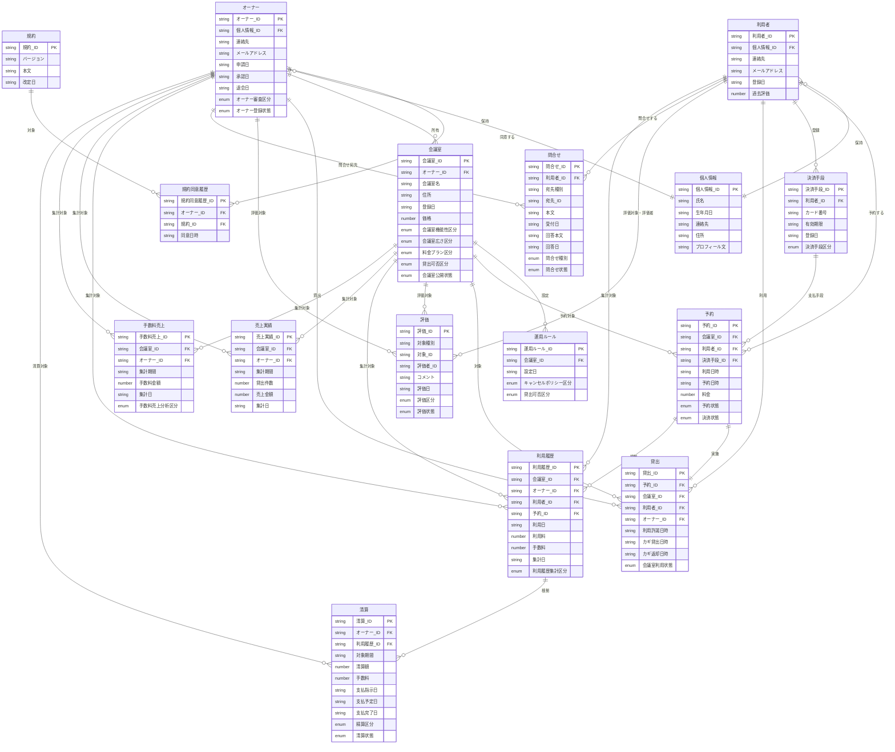

# 論理データモデル

貸し会議室サービス の RDRA 定義（`1_RDRA/if/関連データ.txt`）から導出した論理データモデルを定義する。

## 論理データ一覧

### オーナー

| 項目名 | タイプ | isKey | 説明 |
| --- | --- | --- | --- |
| オーナー_ID | string | true | オーナーの主キー |
| 個人情報_ID | string | false | オーナーの個人情報への外部キー |
| 連絡先 | string | false | 連絡先（電話番号等） |
| メールアドレス | string | false | メールアドレス |
| 申請日 | string | false | オーナー申請日 |
| 承認日 | string | false | オーナー承認日 |
| 退会日 | string | false | オーナー退会日 |
| オーナー審査区分 | enum | false | オーナー申請の審査結果（承認、却下、保留） |
| オーナー登録状態 | enum | false | オーナー登録の状態（申請中、審査中、承認、却下、退会） |

### 個人情報

オーナー・利用者が共通で持つ個人情報を別論理データとして抜き出したもの。

| 項目名 | タイプ | isKey | 説明 |
| --- | --- | --- | --- |
| 個人情報_ID | string | true | 個人情報の主キー |
| 氏名 | string | false | 氏名 |
| 生年月日 | string | false | 生年月日 |
| 連絡先 | string | false | 連絡先 |
| 住所 | string | false | 住所 |
| プロフィール文 | string | false | プロフィール文 |

### 規約

| 項目名 | タイプ | isKey | 説明 |
| --- | --- | --- | --- |
| 規約_ID | string | true | 規約の主キー |
| バージョン | string | false | 規約バージョン |
| 本文 | string | false | 規約本文 |
| 改定日 | string | false | 規約改定日 |

### 規約同意履歴

オーナーと規約の同意関係を表す履歴。オーナー登録の前提として使われる。

| 項目名 | タイプ | isKey | 説明 |
| --- | --- | --- | --- |
| 規約同意履歴_ID | string | true | 規約同意履歴の主キー |
| オーナー_ID | string | false | 同意したオーナーへの外部キー |
| 規約_ID | string | false | 同意対象の規約への外部キー |
| 同意日時 | string | false | 同意日時 |

### 会議室

| 項目名 | タイプ | isKey | 説明 |
| --- | --- | --- | --- |
| 会議室_ID | string | true | 会議室の主キー |
| オーナー_ID | string | false | 会議室を所有するオーナーへの外部キー |
| 会議室名 | string | false | 会議室の名称 |
| 住所 | string | false | 会議室の住所 |
| 登録日 | string | false | 登録日 |
| 価格 | number | false | 基本価格 |
| 会議室機能性区分 | enum | false | 備え付け機能（プロジェクター、ホワイトボード、Wi-Fi、スクリーン、音響設備、テレビ会議設備） |
| 会議室広さ区分 | enum | false | 広さ区分（少人数用、中規模、大規模） |
| 料金プラン区分 | enum | false | 料金プラン（時間単位、半日、一日） |
| 貸出可否区分 | enum | false | 貸出可否（貸出可、貸出停止） |
| 会議室公開状態 | enum | false | 会議室公開の状態（下書き、公開中、貸出停止、削除） |

### 運用ルール

会議室の運用ルール（子情報）。

| 項目名 | タイプ | isKey | 説明 |
| --- | --- | --- | --- |
| 運用ルール_ID | string | true | 運用ルールの主キー |
| 会議室_ID | string | false | 親となる会議室への外部キー |
| 設定日 | string | false | ルール設定日 |
| キャンセルポリシー区分 | enum | false | キャンセルポリシー（無料キャンセル、一部返金、返金なし） |
| 貸出可否区分 | enum | false | 貸出可否（貸出可、貸出停止） |

### 利用者

| 項目名 | タイプ | isKey | 説明 |
| --- | --- | --- | --- |
| 利用者_ID | string | true | 利用者の主キー |
| 個人情報_ID | string | false | 利用者の個人情報への外部キー |
| 連絡先 | string | false | 連絡先 |
| メールアドレス | string | false | メールアドレス |
| 登録日 | string | false | 利用者登録日 |
| 過去評価 | number | false | 利用者の過去評価値（集計値） |

### 決済手段

| 項目名 | タイプ | isKey | 説明 |
| --- | --- | --- | --- |
| 決済手段_ID | string | true | 決済手段の主キー |
| 利用者_ID | string | false | 決済手段を登録した利用者への外部キー |
| カード番号 | string | false | カード番号（暗号化想定） |
| 有効期限 | string | false | 有効期限 |
| 登録日 | string | false | 登録日 |
| 決済手段区分 | enum | false | 決済手段種別（クレジットカード、電子マネー） |

### 予約

| 項目名 | タイプ | isKey | 説明 |
| --- | --- | --- | --- |
| 予約_ID | string | true | 予約の主キー |
| 会議室_ID | string | false | 予約対象の会議室への外部キー |
| 利用者_ID | string | false | 予約した利用者への外部キー |
| 決済手段_ID | string | false | 予約時の決済手段への外部キー |
| 利用日時 | string | false | 会議室の利用日時 |
| 予約日時 | string | false | 予約した日時 |
| 料金 | number | false | 予約時の料金 |
| 予約状態 | enum | false | 予約の状態（仮予約、確定、変更済、取消、利用済、ノーショー） |
| 決済状態 | enum | false | 決済の状態（登録済、オーソリ済、引落済、失敗、返金済） |

### 貸出

| 項目名 | タイプ | isKey | 説明 |
| --- | --- | --- | --- |
| 貸出_ID | string | true | 貸出の主キー |
| 予約_ID | string | false | 対応する予約への外部キー |
| 会議室_ID | string | false | 貸出対象の会議室への外部キー |
| 利用者_ID | string | false | 利用した利用者への外部キー |
| オーナー_ID | string | false | 貸出を実施したオーナーへの外部キー |
| 利用許諾日時 | string | false | 利用許諾を行った日時 |
| カギ貸出日時 | string | false | カギを貸出した日時 |
| カギ返却日時 | string | false | カギが返却された日時 |
| 会議室利用状態 | enum | false | 会議室利用状態（鍵貸出済（利用中）、鍵返却済（利用終了）、キャンセル） |

### 評価

利用者・会議室・オーナー（ホスト）を対象とする評価。対象種別で参照先を切り替える。

| 項目名 | タイプ | isKey | 説明 |
| --- | --- | --- | --- |
| 評価_ID | string | true | 評価の主キー |
| 対象種別 | string | false | 評価対象の種別（会議室／オーナー／利用者） |
| 対象_ID | string | false | 評価対象のID（対象種別と組合せで特定） |
| 評価者_ID | string | false | 評価を行った主体のID（利用者_ID または オーナー_ID） |
| コメント | string | false | 評価コメント |
| 評価日 | string | false | 評価を行った日 |
| 評価区分 | enum | false | 評価値（星1、星2、星3、星4、星5） |
| 評価状態 | enum | false | 評価状態（評価済、公開中、非公開） |

### 問合せ

| 項目名 | タイプ | isKey | 説明 |
| --- | --- | --- | --- |
| 問合せ_ID | string | true | 問合せの主キー |
| 利用者_ID | string | false | 問合せを行った利用者への外部キー |
| 宛先種別 | string | false | 問合せ宛先の種別（オーナー／サービス運営） |
| 宛先_ID | string | false | 問合せ宛先のID（宛先種別と組合せで特定） |
| 本文 | string | false | 問合せ本文 |
| 受付日 | string | false | 問合せ受付日 |
| 回答本文 | string | false | 回答本文 |
| 回答日 | string | false | 回答日 |
| 問合せ種別 | enum | false | 問合せの種別（トラブル、質問、要望、クレーム） |
| 問合せ状態 | enum | false | 問合せ状態（受付、対応中、回答済、クローズ） |

### 利用履歴

| 項目名 | タイプ | isKey | 説明 |
| --- | --- | --- | --- |
| 利用履歴_ID | string | true | 利用履歴の主キー |
| 会議室_ID | string | false | 会議室への外部キー |
| オーナー_ID | string | false | オーナーへの外部キー |
| 利用者_ID | string | false | 利用者への外部キー |
| 予約_ID | string | false | 予約への外部キー |
| 利用日 | string | false | 利用日 |
| 利用料 | number | false | 利用料 |
| 手数料 | number | false | 手数料 |
| 集計日 | string | false | 集計日 |
| 利用履歴集計区分 | enum | false | 集計区分（会員別、物件別） |

### 売上実績

| 項目名 | タイプ | isKey | 説明 |
| --- | --- | --- | --- |
| 売上実績_ID | string | true | 売上実績の主キー |
| 会議室_ID | string | false | 会議室への外部キー |
| オーナー_ID | string | false | オーナーへの外部キー |
| 集計期間 | string | false | 集計期間 |
| 貸出件数 | number | false | 貸出件数 |
| 売上金額 | number | false | 売上金額 |
| 集計日 | string | false | 集計日 |

### 手数料売上

| 項目名 | タイプ | isKey | 説明 |
| --- | --- | --- | --- |
| 手数料売上_ID | string | true | 手数料売上の主キー |
| 会議室_ID | string | false | 会議室への外部キー |
| オーナー_ID | string | false | オーナーへの外部キー |
| 集計期間 | string | false | 集計期間 |
| 手数料金額 | number | false | 手数料金額 |
| 集計日 | string | false | 集計日 |
| 手数料売上分析区分 | enum | false | 分析区分（会議室別、貸出別） |

### 清算

| 項目名 | タイプ | isKey | 説明 |
| --- | --- | --- | --- |
| 清算_ID | string | true | 清算の主キー |
| オーナー_ID | string | false | 清算対象のオーナーへの外部キー |
| 利用履歴_ID | string | false | 清算の根拠となる利用履歴への外部キー |
| 対象期間 | string | false | 清算対象期間 |
| 清算額 | number | false | 清算額 |
| 手数料 | number | false | 控除する手数料 |
| 支払指示日 | string | false | 決済機関への支払指示日 |
| 支払予定日 | string | false | 支払予定日 |
| 支払完了日 | string | false | 支払完了日 |
| 精算区分 | enum | false | 清算区分（清算対象、清算済、保留） |
| 清算状態 | enum | false | 清算状態（清算対象、清算中、支払済、保留） |

## ER図

